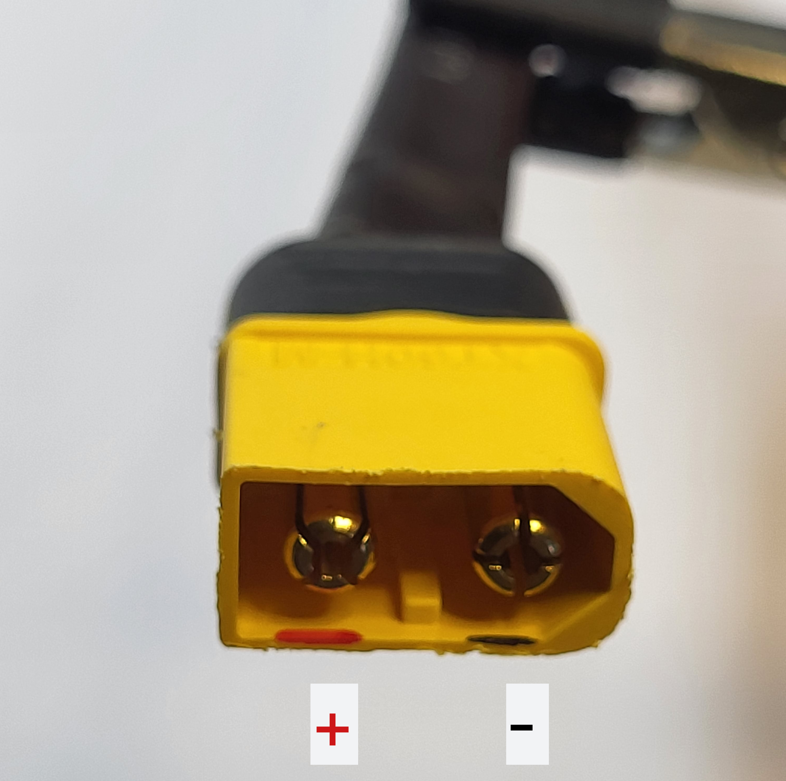

# Everything Sovol SV06

A repository containing specifications of the Sovol SV06 3D printer parts, as well as links to aftermarket replacement parts.

You can assume that all information herein is accurate unless stated otherwise.

Besides many hours, I have spent roughly ~~CAD$80~~ CAD$85 on unusable parts in order to find aftermarket replacements for the SV06. If you found this work useful, please consider buying me a [](https://ko-fi.com/bassamanator).

You can also contribute by making a [pull-request](https://github.com/bassamanator/everything-sovol-sv06/pulls), creating an [issue](https://github.com/bassamanator/everything-sovol-sv06/issues), or starting a [discussion](https://github.com/bassamanator/everything-sovol-sv06/discussions).

*Some of the links found on this page may be affiliate links.*

## To do:

- [ ] Add stepper motor information.
- [x] Add Z coupler specs.
- [x] Add heatblock specs.
- [x] Verify heatblock specs.
- [x] Add heatbreak specs.
- [x] Add heater cartridge specs; no direct aftermarket source is possible.
- [x] Add thermistor specs.
- [ ] Add thermistor direct replacement aftermarket [option](https://s.click.aliexpress.com/e/_DmxAvaV).
- [X] Add PSU related information.

## Stay Up-to-Date

This repository is a work in progress. Watch for updates:


## Hotend

### PCB SV06ZJB_V1.4


| Label | Connection | PCB Connection | Other Connection | Other info |
| - | - | - | - | - |
| P3 | Coldend fan | JST 1.25mm 2-Pin |  |  |
| P2 | Extruder motor | JST 1.25mm 4-Pin | JST PH 2.0 6-Pin (*needs confirmation*) | Cable length 12cm |
| P4 | Heater cartridge | JST PH 2.0 2-Pin |  |  |
| P8 | Thermistor | JST 1.25mm 2-Pin |  |  |
| P6 | Probe  | JST 1.25mm 5-Pin |  |  |
| P5 | Part cooling fan | JST 1.25mm 2-Pin |  |  |
| P7 | Filament sensor | JST 1.25mm 3-Pin |  |  |

### Filament Sensor

I tested two random filament runout sensors that I had on hand. Both work just fine. It seems to me that any sensor with `VCC`, `Ground`, and `Signal` pins should work.

In order to get the filament sensor working, just make sure that the `VCC`, `Ground`, and `Signal` line up with the pins on the hotend PCB, port `P7`.

In order to 'mount' the sensor while it's not in use, simply glue a small magnet onto the sensor. You can then stick the sensor onto the extruder motor. You might also want to tether the sensor to the extruder cable with a piece of string.

Klipper filament configuration section:
```
[filament_switch_sensor filament_sensor]
switch_pin: !PA4 # "Pulled-high"
pause_on_runout: True
insert_gcode:
    M117 Insert Detected
runout_gcode:
    M117 Runout Detected
```

The complete Klipper code to make this work is part of my [OSS Klipper Configuration](https://github.com/bassamanator/Sovol-SV06-firmware).


#### Aftermarket Options

These can be found for very cheap (roughly $1.5) on Aliexpress and quite a bit more on  Amazon (though still very afforable). [This](https://s.click.aliexpress.com/e/_DDLpdBX) is the one I bought. Here's another seemingly [viable option](https://s.click.aliexpress.com/e/_DDPNmDX).

#### How To Cable

You need to make your own cable. I recommend getting these [JST 1.25 cables](https://s.click.aliexpress.com/e/_DDORZ0D), and this [XH2.54 kit](https://s.click.aliexpress.com/e/_DlejPpj). You will also need a crimping tool such as the [Engineer PA-09](https://www.amazon.ca/gp/product/B002AVVO7K/ref=ppx_yo_dt_b_search_asin_title?ie=UTF8&psc=1).
### Heatblock

The heatblock the SV06 uses is a Creality CR10 heatblock with support for an MK8 threaded nozzle (including some M6 nozzles). It has support for a [cartridge heater](https://www.aliexpress.com/item/32817471679.html?spm=a2g0o.productlist.main.21.398f5950SZin7w&algo_pvid=a02d1fa0-6027-439b-80b9-3dfd6d9066bf&algo_exp_id=a02d1fa0-6027-439b-80b9-3dfd6d9066bf-10&pdp_ext_f=%7B%22sku_id%22%3A%2265398686104%22%7D&pdp_npi=3%40dis%21CAD%211.49%211.18%21%21%21%21%21%40211bf3f116794791211837332d0761%2165398686104%21sea%21CA%214666093930&curPageLogUid=QZs3XELKua4B) (6mm) and a [glass-bead thermistor](https://www.aliexpress.com/item/32514751406.html?spm=a2g0o.productlist.main.13.4fc51vs51vs5FC&algo_pvid=4a9f6fcc-9db5-4db7-91e2-68112b03071e&aem_p4p_detail=202303220250351111396485568820005062336&algo_exp_id=4a9f6fcc-9db5-4db7-91e2-68112b03071e-6&pdp_ext_f=%7B%22sku_id%22%3A%2265732281353%22%7D&pdp_npi=3%40dis%21CAD%211.63%211.54%21%21%21%21%21%402102176616794786350847201d0767%2165732281353%21sea%21CA%214666093930&curPageLogUid=ShRbt8qZkw2q&ad_pvid=202303220250351111396485568820005062336_7&ad_pvid=202303220250351111396485568820005062336_7) (2mm). The heatblocks on AliExpress normally come in Brass, Copper Plated and Aluminum. Copper plated offers the best thermal conductivity of all of them which makes it the better option.

<details>
<summary>How to use a M6 Nozzle instead of MK8</summary>
<br>
The threading for both the MK8 and the M6 is the same although the M6 may be taller in height. I currently use a Tungsten Carbide M6 Nozzle with my SV06 printer and some of the issues I've ran into is, over-tightening and the silicone sock not fitting well. 
<br>
The over-tightening issues can be solved by putting in the nozzle while the extruder is very hot (300C) and by tightening slower and using less force.

<br>
A MK10 Silicone sock might fit better than the stock MK8 sock for a M6 nozzle but I have yet to try.


</details>

<p align="center">


The SV06 uses a Creality CR10 heatblock which supports MK8 threaded nozzles (including some M6 nozzles). The material is likely nickel-plated copper (*needs verification*).

The heatblock is mounted onto the extruder assembly using 2 x M2.5 10mm [SHCS](./images/shcs.png).

<p align="center">

</p>

Please see some more relevant details [here](heatblock.md).

#### Aftermarket Options

*Coming soon.*

### Heater Cartridge

The SV06 uses a ceramic heater cartridge.

| Voltage | Watts | Dimensions | Connection | Cable Length |
| - | - | - | - | - |
| 24V | 40W | 6x20mm | JST PH 2.0 2-Pin | ~40mm |

The heater cartridge is glued into the heatblock, a heatblock that heats to 300C. Although possible, it is unadvisable, and potentially dangerous to attempt removal. 

#### Aftermarket Options

Unfortunately, a direct, non-DIY replacement seems unlikely. It appears that no one sells heater cartridges with JST PH 2.0 2-Pin connectors.

You would have to buy a heater cartridge such as [this](https://s.click.aliexpress.com/e/_DeKbxqv), and crimp the appropriate connector on. 

⚠️ Caveat: This is not an ordinary crimp job. The hotend assembly consumes a lot of power and is dangerously hot. Take every precaution.

### Thermistor

The SV06 uses a glass-bead thermistor.

| Material | Dimensions | Connection | Cable Length |
| - | - | - | - |
| Glass | 2mm | JST 1.25mm 2-Pin | ~40mm |

As was the case with the heater cartridge, the thermistor is also glued into place, and is very unlikely to survive removal given the delicacy of the cables and composing material.

#### Aftermarket Options

*Coming soon.*

</p>

#### Heater Cartridge
The SV06 uses a [ceramic heater cartridge](https://www.aliexpress.com/item/1005005047050454.html?aff_fcid=13a72aaa124143d295f16d8f9d9296f5-1679483633001-07248-_DmxAvaV&tt=CPS_NORMAL&aff_fsk=_DmxAvaV&aff_platform=shareComponent-detail&sk=_DmxAvaV&aff_trace_key=13a72aaa124143d295f16d8f9d9296f5-1679483633001-07248-_DmxAvaV&terminal_id=14335827c6f74dbb82cd02956949dfb7&afSmartRedirect=y) which is 40W 24v. It has a [JST-PH 2-pin connector](https://www.aliexpress.com/item/32908472053.html?spm=a2g0o.productlist.main.27.34a07842VA0u0U&algo_pvid=56fd3a56-ea45-49a0-97aa-151e49fb898e&algo_exp_id=56fd3a56-ea45-49a0-97aa-151e49fb898e-13&pdp_ext_f=%7B%22sku_id%22%3A%2265895534505%22%7D&pdp_npi=3%40dis%21CAD%212.89%212.89%21%21%21%21%21%40211bea6216794812702558054d06fe%2165895534505%21sea%21CA%214666093930&curPageLogUid=KEzsCq1b9bZr) to be used with the SV06 PCB. The heater cartridge usually has some thermal paste on it to help with heat transfer, any thermal paste will work.

<details>
<summary>Removing the Heater Cartridge</summary>

Removing the heater cartridge can actually be a challange as the ones stock from the factory may have hardened thermal paste or glue in it. Most people suggest  either powering the 2 heater wires using the SV06 unit (or using a computer PSU's molex cable) or using a heatgun. Then using pliers to pull one side and push the other to slide it out. It can be tricky and for my first time it took me 15 minutes.

</details>

<br>

<details>
<summary>Heater Cartridge Mounting System</summary>

The heater cartridge mounts using 2 [SHCS](https://www.homedepot.com/b/Hardware-Fasteners-Screws-Socket-Head-Cap-Screws/N-5yc1vZc2cy) M2.5 12mm screws which mount the heatblock to the rest of the extruder assembly. Your able to order longer screws by going with either [14mm long or 18mm](https://www.aliexpress.com/item/4000896301219.html?spm=a2g0o.order_list.order_list_main.42.76761802YH6B5B) long screws. Ensure the screws are not for wood as wood screws usually have a pointed end.

</details>

<br>

#### Glass-Bead Thermistor
Most CR10 heatblocks use a [glass-bead thermistor](https://en.wikipedia.org/wiki/Thermistor) with the resistence of the thermistor getting higher as the tempeture increases. The thermistor size that is supported with the stock heatblock is 2mm in diameter which is what the glass bead thermistor uses. The stock thermistor has a [JST 1.25mm 2-pin](https://www.aliexpress.com/item/1005004931013896.html?spm=a2g0o.cart.0.0.6fac38da0aHMsB&mp=1) connector to connect to the PCB. You can also choose to replace it with the more popular, cartridge thermistor below but it will require a drill.
<br>

<details>
<summary>Cartridge Thermistor DIY Replacement</summary>

The tiny wires on the stock thermistor make it easy to break and replacing the entire hotend unit is neither cost effective or friendly for the enviornment. If you have some time on your hands replacing the thermistor and/or heater is a way to reuse the heatblock.

<br>

Some people prefer the Thermistor Cartridge type thermistor because of it's higher durability, ease to use and a larger variety. But I have not found any CR10 heatblocks which support it, meaning the DIY method for supporting the cartridge thermistor would be to drill it with a 1/8 (3mm) drill bit.
</details>
<br>

#### Aftermarket Options
Aftermarket options include various items from [AliExpress](aliexpress.com) and [Ebay](ebay.com).

- [12v 40W Heater Cartridge](https://www.aliexpress.com/item/32817471679.html?spm=a2g0o.productlist.main.21.6c272d4aRvze4O&algo_pvid=3f654cbd-9ad6-4f5f-8673-d736c9e420ac&algo_exp_id=3f654cbd-9ad6-4f5f-8673-d736c9e420ac-10&pdp_ext_f=%7B%22sku_id%22%3A%2265398686104%22%7D&pdp_npi=3%40dis%21CAD%211.49%211.18%21%21%21%21%21%40212248ba16794819700476621d06d3%2165398686104%21sea%21CA%214666093930&curPageLogUid=lIXPchRUPLtg), requires JST connector crimping

- [100k NTC-3950 Glass Bead Thermistor](https://www.aliexpress.com/item/1005004106475245.html?spm=a2g0o.productlist.main.87.206c68b2OAp8Jh&algo_pvid=e0345636-69a1-4676-bbd0-74733b733d18&algo_exp_id=e0345636-69a1-4676-bbd0-74733b733d18-43&pdp_ext_f=%7B%22sku_id%22%3A%2212000028053734600%22%7D&pdp_npi=3%40dis%21CAD%2111.44%215.72%21%21%21%21%21%40211bf2da16794820406441328d070e%2112000028053734600%21sea%21CA%214666093930&curPageLogUid=LCSf3U8ivtGH), requires JST connector crimping

- [NTC3950 thermistor](https://www.aliexpress.com/item/4000119163065.html?aff_fcid=16d7a9eda7874192a566e354ac56c563-1680055642647-09915-_DCq3Ym5&tt=CPS_NORMAL&aff_fsk=_DCq3Ym5&aff_platform=shareComponent-detail&sk=_DCq3Ym5&aff_trace_key=16d7a9eda7874192a566e354ac56c563-1680055642647-09915-_DCq3Ym5&terminal_id=14335827c6f74dbb82cd02956949dfb7&afSmartRedirect=y), requires JST connector crimping.

- [JST Connector for Thermistor wiring and more](https://www.aliexpress.com/item/1005004931013896.html?spm=a2g0o.order_list.order_list_main.21.76761802YH6B5B)

[//]: <> (//todo needs more links to Aliexpress and Ebay sites)

### Heatbreak


| Cooper Portion | Overall Length | Outer Dia. | Inner Dia. |
| - | - | - | - |
| 15mm | 22mm | 7mm| 2mm|


#### Aftermarket Options

I purchased and tested [this heatbreak](https://s.click.aliexpress.com/e/_DmzWJNb). It works as well as the stock piece.

*The part sold in the link could change, so make sure it has the following specs*:


## Motherboard


## Lead Screws and Rods

### Lead Screws

| Axis | Qty | Length | Dia. | Lead | Pitch | Starts | Sovol Part # |
| - | - | - | - | - | - | - | - |
| Z | 2 | 376mm | 8mm | 4mm | 2mm | 2 | JXHSV06-02003-a |

### Linear Motion Guide Rods

| Axis | Qty | Length | Dia. | Sovol Part # |
| - | - | - | - | - |
| X | 2 | 355mm | 8mm | JXHSV06-03001-a |
| Y | 2 | 340mm | 8mm | JXHSV06-01012-a |
| Z | 2 | 400mm | 8mm | JXHSV06-02004-a |

## Z Axis Couplers


| Type | Qty | Dia.| Length | Motor Shaft Dia. | Lead Screw Dia. |
| - | - | - | - | - | - |
| Rigid | 2 | 20mm | 25mm | 5mm | 8mm |

## PSU Related


### PSU Connections


### PSU Switch


### Other PSU Cable




## Sovol Repositories

- [Marlin source code](https://github.com/Sovol3d/Sv06-Source-Code)
- [Printer parts STL and STEP files](https://github.com/Sovol3d/SV06-Fully-Open-Source)

## Useful Resources

- [*OSS* Sovol SV06 Klipper Configuration](https://github.com/bassamanator/Sovol-SV06-firmware/tree/master)
- [RP2040-Zero ADXL345 Connection Klipper](https://github.com/bassamanator/rp2040-zero-adxl345-klipper)

[](https://ko-fi.com/H2H0HIHTH)
