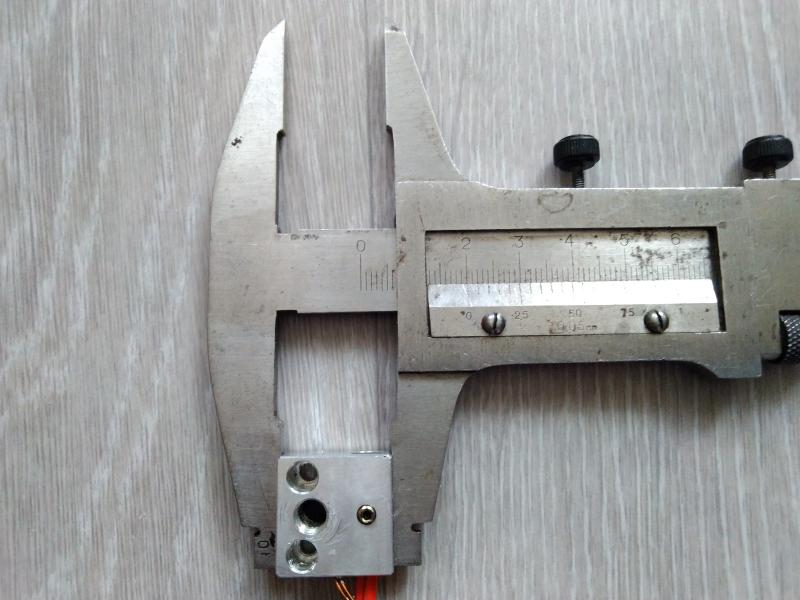
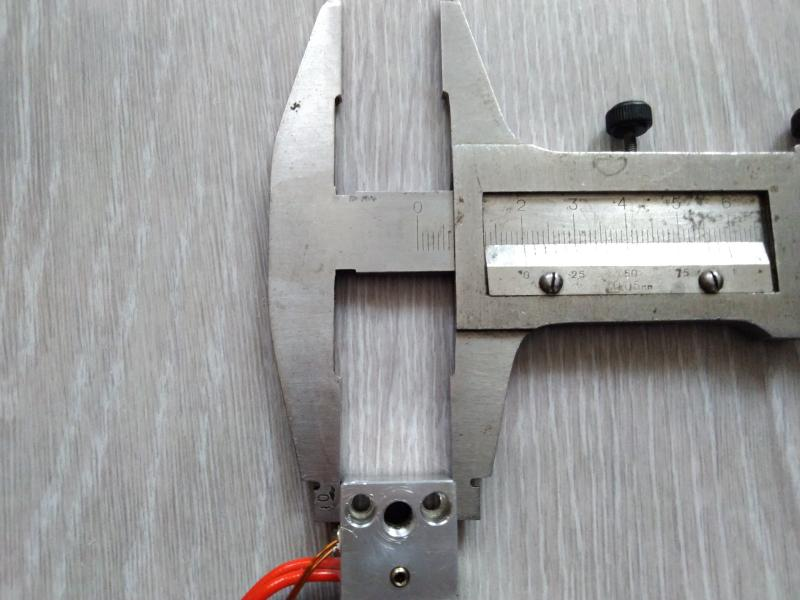
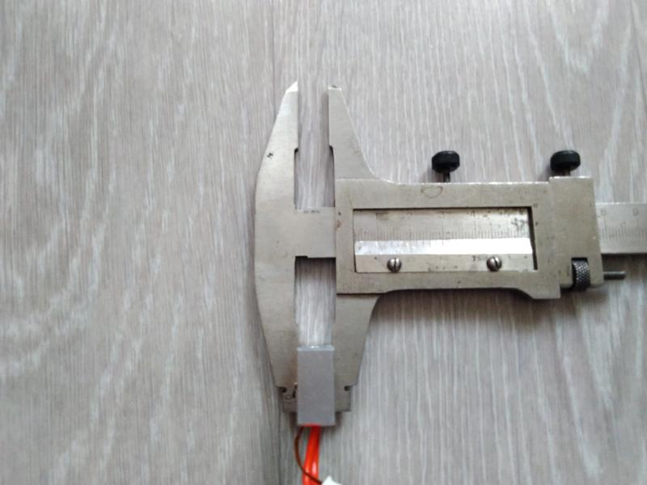

# Everything Sovol SV06

A repository containing specifications of the Sovol SV06 3D printer parts, as well as links to aftermarket replacement parts.

I have spent roughly CAD$80 on unusable parts in order to find aftermarket replacements for the SV06. Please consider buying me a . All funds raised will be used on this project.

You can also contribute by making a [pull-request](https://github.com/bassamanator/everything-sovol-sv06/pulls), creating an [issue](https://github.com/bassamanator/everything-sovol-sv06/issues), or starting a [discussion](https://github.com/bassamanator/everything-sovol-sv06/discussions).

*Some of the links found on this page may be affiliate links.*

## To do:

- [ ] Add stepper motor information.
- [x] Add Z coupler specs.
- [x] Add heatblock specs.
- [ ] Verify heatblock specs.
- [x] Add heatbreak specs.
- [ ] Add heater cartridge specs.

## Stay Up-to-Date

This repository is a work in progress. Watch for updates:

## Hotend

### SV06ZJB_V1.4

| Label | Connection | PCB Connection | Other Connection | Other info |
| - | - | - | - | - |
| P3 | Coldend fan | JST 1.25mm 2-Pin |  |  |
| P2 | Extruder motor | JST 1.25mm 4-Pin | JST PH 2.0 6-Pin (*needs confirmation*) | Cable length 12cm |
| P4 | Heater cartridge | JST PH 2.0 2-Pin |  |  |
| P8 | Thermistor | JST 1.25mm 2-Pin |  |  |
| P6 | Probe  | JST 1.25mm 5-Pin |  |  |
| P5 | Part cooling fan | JST 1.25mm 2-Pin |  |  |
| P7 | Filament sensor (*verified*)| JST 1.25mm 3-Pin |  |  |

## Motherboard

## Lead Screws and Rods

### Lead Screws

| Axis | Qty | Length | Dia. | Lead | Pitch | Starts | Sovol Part # |
| - | - | - | - | - | - | - | - |
| Z | 2 | 376mm | 8mm | 4mm | 2mm | 2 | JXHSV06-02003-a |

### Linear Motion Guide Rods

| Axis | Qty | Length | Dia. | Sovol Part # |
| - | - | - | - | - |
| X | 2 | 350mm | 8mm | JXHSV06-03001-a |
| Y | 2 | 340mm | 8mm | JXHSV06-01012-a |
| Z | 2 | 400mm | 8mm | JXHSV06-02004-a |

## Z Axis Couplers

| Type | Qty | Dia.| Length | Motor Shaft Dia. | Lead Screw Dia. |
| - | - | - | - | - | - |
| Rigid | 2 | 20mm | 25mm | 5mm | 8mm |

## Heatblock

| Height | Length | Thickness |
| - | - | - |
| 20mm | 20mm| 10mm|

  

## Heatbreak

| Cooper Portion | Overall Length | Outer Dia. | Inner Dia. |
| - | - | - | - |
| 15mm | 22mm | 7mm| 2mm|

#### Aftermarket Options

##### Heatbreaks
 | Name/Link | User | SV06-Compatible | Notes |
 | - | - | - | - |
 | [MEGA 2pcs E3D Heat Break V6 Throat M6 M7 Thread Bi-metal For E3D V6 Hotend](https://s.click.aliexpress.com/e/_DmzWJNb)  | @bassamanator | Yes | Purchased and tested. It works as well as the stock piece. *The part sold in the link could change, so make sure it has the following specs*: |
 | [2pcs Super Smooth Titanium Alloy Heatbreak](https://www.amazon.com/dp/B07JD2S4GK?ref=ppx_pop_mob_ap_share) | @transistor1 | Yes, with caveats | Purchased and tested.  It works, but it doesn't fit snugly into the extruder opening. At the time of writing, I have been using it for about 12 hours with no leaking. |
 | [Sovol 3pcs Bi-metal Heatbreak](https://www.amazon.com/dp/B0BJDPS741?psc=1&ref=ppx_yo2ov_dt_b_product_details) | @transistor1 | **NO** | Tested. **DO NOT PURCHASE**; this is incompatible with the SV06's heatbreak.  Its outer diameter is too large. |

##### Heatblocks
 | Name/Link | User | SV06-Compatible | Notes |
 | - | - | - | - |
 | [ChowThink 1-Pack High Temperature CR-10 Plated Copper Heater Block for MK8 Extruder](https://a.co/d/7dlSiH5) | @transistor1 | Yes, with caveats | Tested, but does not come with the correct screw size. Sovol SV06 extruder uses M2.5 machine screws (I believe 0.5mm pitch but not certain).  Stock screws are too short to use, so you must order some screws.  Suggestion in the Other section. |
 
##### Thermistors/Heating Cartridges
 | Name/Link | User | SV06-Compatible | Notes |
 | - | - | - | - |
 | [Sprite Extruder Pro Kit 300℃ Cartridge Heater 24V 40W + Thermistor NTC100K High Temperature Sensor](https://a.co/d/5lAXUmq) | @transistor1 | Yes, with caveats | The thermistor uses an XH1.25 JST connector, which fits the stock Sovol terminal, but the heating cartridge has an XH2.54 JST connector, which is not what the Sovol's extruder board accepts.  The extruder board uses a JST PHR-2 connector. There is a link to the connector in the Other section |

##### Other
 | Name/Link | User | SV06-Compatible | Notes |
 | - | - | - | - |
 | [Taiss 580PCS JST PH Connector kit 2.0mm 2/3/4/5/6Pin Housing,Female and Male Adapter Cable Connector](https://a.co/d/cfq421p) | @transistor1 | Yes | PHR-2 is the correct size for the SV06's heating cartridge. Requires a special crimping tool, but I was able to get the contacts on using a plier. |
 | [Hexagon Hex Socket Head Cap Allen Bolt Screw](https://a.aliexpress.com/_mOp3Dhc) | @transistor1 | Unknown | Ordered M2.5, 20mm length. Not yet tested, but hoping this will fit the ChowThink heat block. |
 
## Sovol Repositories

- [Marlin source code](https://github.com/Sovol3d/Sv06-Source-Code)
- [Printer parts STL and STEP files](https://github.com/Sovol3d/SV06-Fully-Open-Source)

## Useful Resources

- [*OSS* Sovol SV06 Klipper Configuration](https://github.com/bassamanator/Sovol-SV06-firmware/tree/master)
- [RP2040-Zero ADXL345 Connection Klipper](https://github.com/bassamanator/rp2040-zero-adxl345-klipper)

