# Everything Sovol SV06

A repository containing specifications of the Sovol SV06 3D printer parts, as well as links to aftermarket replacement parts.

You can assume that all information herein is accurate unless stated otherwise.

If you found this work useful, please consider buying me a [](https://ko-fi.com/bassamanator).

You can also contribute by making a [pull-request](https://github.com/bassamanator/everything-sovol-sv06/pulls), creating an [issue](https://github.com/bassamanator/everything-sovol-sv06/issues), or starting a [discussion](https://github.com/bassamanator/everything-sovol-sv06/discussions).

_Some of the links found on this page may be affiliate links._

# Outline

1. [Hotend](#hotend)
   - [PCB](#pcb)
   - [Heatblock](#heatblock)
     - [Heater Cartridge](#heater-cartridge)
     - [Thermistor](#thermistor)
     - [Heatbreak](#heatbreak)
     - [Nozzle](#nozzle)
   - [Filament Sensor](#filament-sensor)
   - [Probe](#probe)
   - _Fans_
   - _Extruder_
2. [Motherboard](#motherboard)
3. [Lead Screws and Rods](#lead-screws-and-rods)
   - [Lead Screws](#lead-screws)
   - [Linear Motion Guide Rods](#linear-motion-guide-rods)
   - [Linear Bearings](#linear-bearings)
   - [Z Axis Couplers](#z-axis-couplers)
   - [Belts](#belts)
4. [PSU Related](#psu-related)
5. [Stepper Motors](#stepper-motors)

- [Initial Steps ⚡](./initialsteps.md)
- [Useful Prints 🏗️](./parts/README.md#printed-parts)
- [Sample Prints 🍰](./images/prints/README.md)
- [How-to 🛠️](./howto.md)
- [Support Me ❤️](#support-me)
- [Stay Up-to-Date](#stay-up-to-date)
- [Links](#useful-links)

# Hotend

## PCB

Revision: `SV06ZJB_V1.4`


| Label | Connection       | PCB Connection   | Other Connection | Other info        |
| ----- | ---------------- | ---------------- | ---------------- | ----------------- |
| P3    | Coldend fan      | JST 1.25mm 2-Pin |                  |                   |
| P2    | Extruder motor   | JST 1.25mm 4-Pin | JST PH 2.0 6-Pin | Cable length 12cm |
| P4    | Heater cartridge | JST PH 2.0 2-Pin |                  |                   |
| P8    | Thermistor       | JST 1.25mm 2-Pin |                  |                   |
| P6    | Probe            | JST 1.25mm 5-Pin |                  |                   |
| P5    | Part cooling fan | JST 1.25mm 2-Pin |                  |                   |
| P7    | Filament sensor  | JST 1.25mm 3-Pin |                  |                   |

## Heatblock

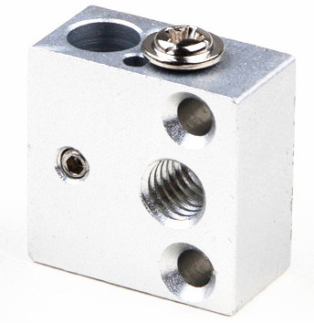

| Model         | Material |
| ------------- | -------- |
| Creality CR10 | Aluminum |

Notes:

- The heatblock is mounted onto the extruder assembly using `2 x M2.5 x 10mm` [SHCS](./images/shcs.png).
- Newer heatblocks appear to have a 3mm thermistor hole.

<p align="center">
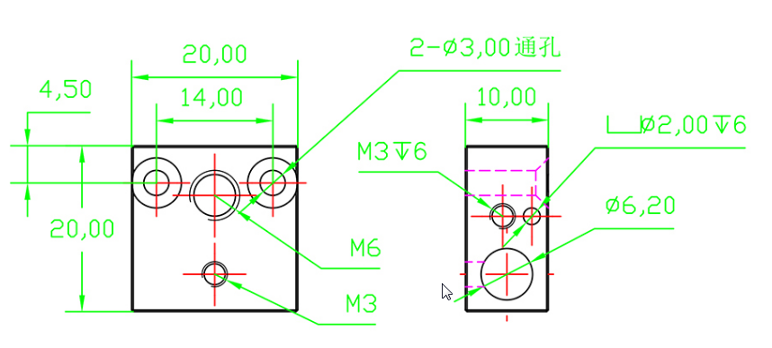
</p>

### Aftermarket Options

Any of [these](https://www.aliexpress.com/item/32969219551.html) heatblocks will do just fine, however, they _may_ require mounting bolts of different sizes.

- The [Type C](https://s.click.aliexpress.com/e/_DEfTKT1) has 2mm and 3mm thermistor holes.
- I have the `Type C`. The original mounting bolts will not be long enough, you will need [2 x M2.5 x 16mm FHCS](https://s.click.aliexpress.com/e/_DFDH4Hl) ([2 x M2.5 x 18mm FHCS](https://s.click.aliexpress.com/e/_DEbXHQ7) will also work).

### Heater Cartridge

The SV06 uses a ceramic heater cartridge.

| Voltage | Watts | Dimensions | Connection       | Cable Length |
| ------- | ----- | ---------- | ---------------- | ------------ |
| 24V     | 50W   | 6x20mm     | JST PH 2.0 2-Pin | ~40mm        |

The heater cartridge is glued into the heatblock, a heatblock that heats to 300C. Although possible, it is inadvisable, and potentially dangerous to attempt removal.

#### Aftermarket Options

Unfortunately, a direct, non-DIY replacement seems unlikely. It appears that no one sells heater cartridges with JST PH 2.0 2-Pin connectors.

You would have to buy a heater cartridge such as [this](https://s.click.aliexpress.com/e/_DeKbxqv), and crimp the appropriate connector on.

⚠️ This is not an ordinary crimp job. The hotend assembly consumes a lot of power and is dangerously hot. Take every precaution.

### Thermistor

| Material   | Dimensions | Connection       | Cable Length |
| ---------- | ---------- | ---------------- | ------------ |
| Glass-bead | 2mm        | JST 1.25mm 2-Pin | ~40mm        |

The thermistor is held in place with the help of a screw, and a generous amount of thermal adhesive. With the help of a heat-gun, and with great care, it can be removed.

#### Aftermarket Options

- [3mm Tube Thermistor](https://s.click.aliexpress.com/e/_DnBUliL)
  - Please note that this thermistor will **not** fit in the stock heatblock. You need a heatblock that has a 3mm thermistor hole.
- [3mm Tube Thermistor 4 units](https://s.click.aliexpress.com/e/_Dmwf20F)
  - **Untested** though it looks exactly the same as the option above.
  - Cheaper than then first option.
  - Please note that this thermistor will **not** fit in the stock heatblock. You need a heatblock that has a 3mm thermistor hole.

### Heatbreak

<!-- 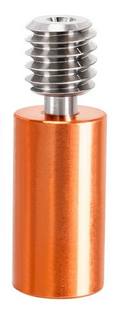 -->

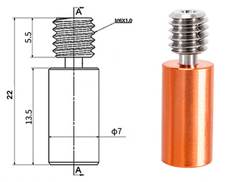

| Cooper Portion | Overall Length | Outer Dia. | Inner Dia. |
| -------------- | -------------- | ---------- | ---------- |
| 15mm           | 22mm           | 7mm        | 2mm        |

#### Aftermarket Options

I purchased and tested [this heatbreak](https://s.click.aliexpress.com/e/_DmzWJNb).

- It works as well as the stock piece.
- ⚠️ It is 1mm shorter than the stock piece, so you will need a washer or spacer of some kind to 'increase' it's length. If you don't add a spacer, your part cooling duct will be exactly inline with the nozzle tip, meaning that the part cooling duct will drag across every new layer. The spacer must not be more than 7mm in diameter.

_The part sold in the link could change, so make sure it has the following specs_:

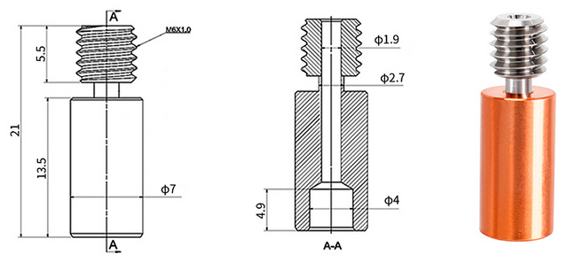

### Nozzle

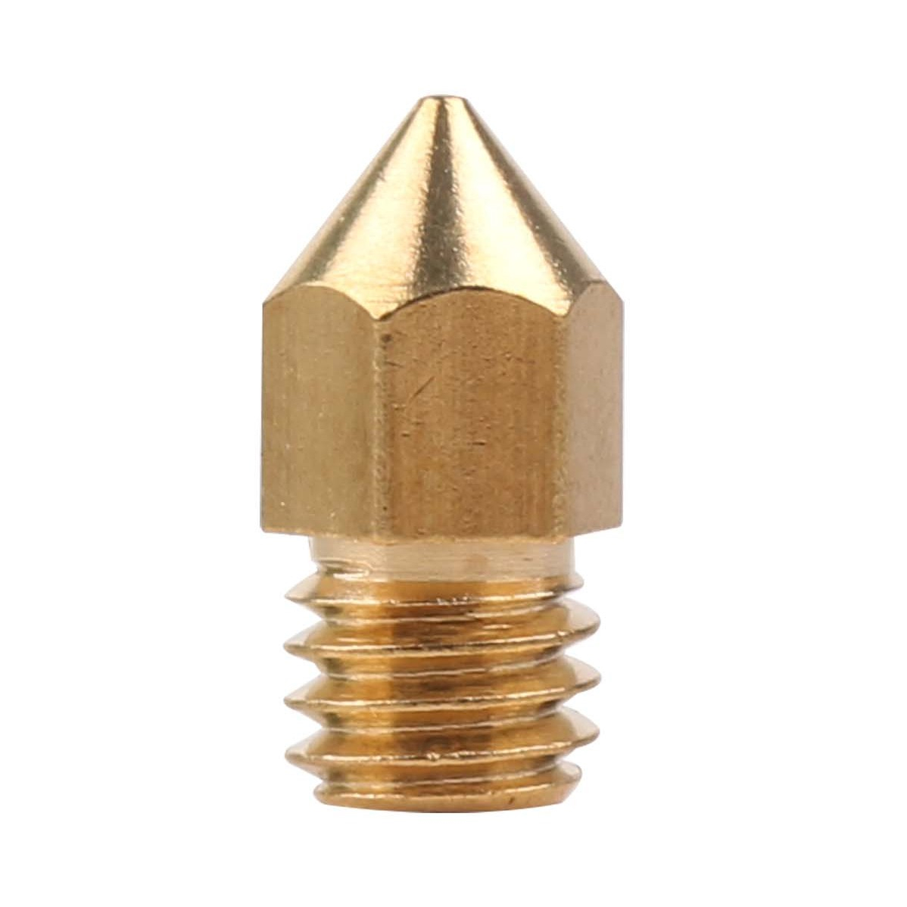

| Type | Thread |
| ---- | ------ |
| MK8  | M6     |

Any MK8 nozzle will do. You can even use a [V6 style nozzle](./images/nozzle/nozzle-comparison.jpg).

#### Aftermarket Options

**Any** MK8 nozzle will be fine. I like [these](https://s.click.aliexpress.com/e/_DCDKb0n) because they're chunky.

##### SV06 Plus

A Creality K1 nozzle seems like a suitable replacement (_needs verification_), however, it is 0.5mm shorter than the stock variant. You have to make use of a washer/spacer to correct for this, see [Heatbreak, Aftermarket](#aftermarket-options-3) section.

## Filament Sensor

I tested two random filament runout sensors that I had on hand. Both work just fine. It seems to me that any sensor with `VCC`, `Ground`, and `Signal` pins should work.

In order to get the filament sensor working, just make sure that the `VCC`, `Ground`, and `Signal` line up with the pins on the hotend PCB, port `P7`.

In order to 'mount' the sensor while it's not in use, simply glue a small magnet onto the sensor. You can then stick the sensor onto the extruder motor. You might also want to tether the sensor to the extruder cable with a piece of string.

Klipper filament configuration section:

```
[filament_switch_sensor filament_sensor]
switch_pin: !PA4 # "Pulled-high"
pause_on_runout: True
insert_gcode:
    M117 Insert Detected
runout_gcode:
    M117 Runout Detected
```

The complete Klipper code to make this work is part of my [OSS Klipper Configuration](https://github.com/bassamanator/Sovol-SV06-firmware).

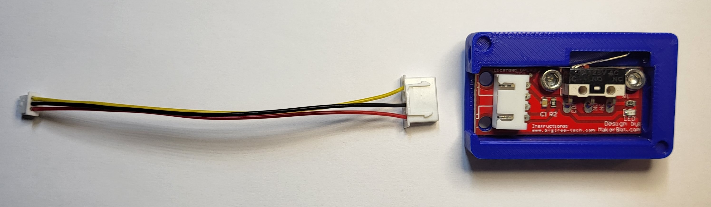
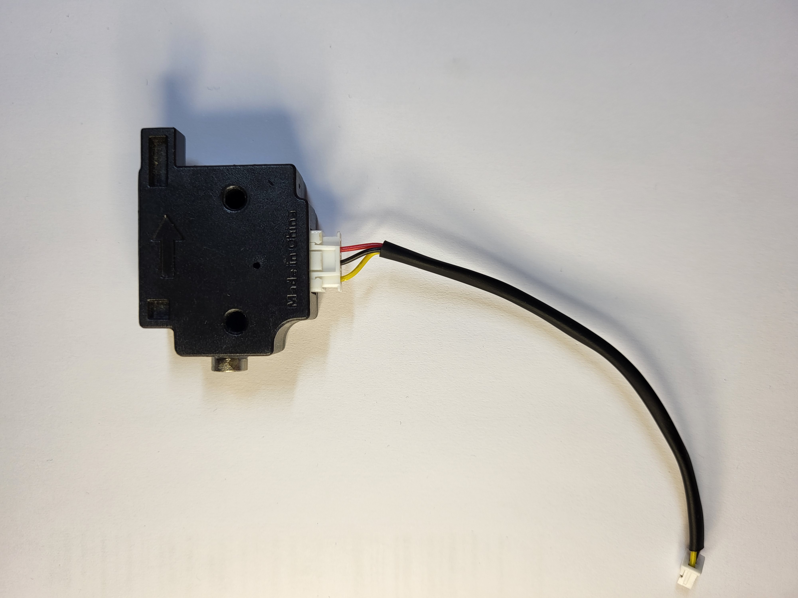
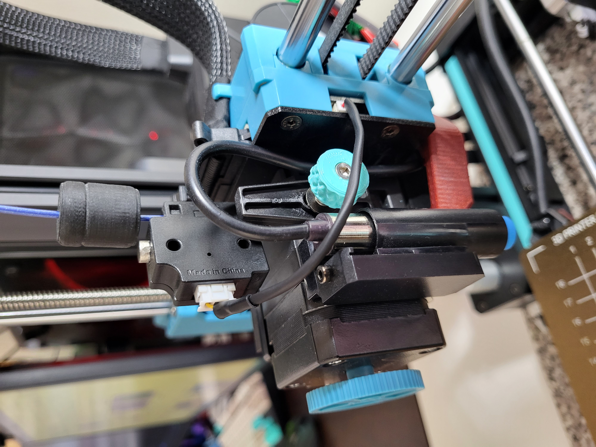

### Aftermarket Options

These can be found for very cheap (roughly $1.5) on Aliexpress and quite a bit more on Amazon (though still very affordable). [This](https://s.click.aliexpress.com/e/_DDLpdBX) is the one I bought. Here's another seemingly [viable option](https://s.click.aliexpress.com/e/_DDPNmDX).

### Cable How-To

You need to make your own cable. I recommend getting these [JST 1.25 cables](https://s.click.aliexpress.com/e/_DDORZ0D), and this [XH2.54 kit](https://s.click.aliexpress.com/e/_DlejPpj). You will also need a crimping tool such as the [Engineer PA-09](https://www.amazon.ca/gp/product/B002AVVO7K/ref=ppx_yo_dt_b_search_asin_title?ie=UTF8&psc=1).

## Probe

<p align="center">
    
</p>

| Part          | Voltage | Type                  | Measuring Distance |
| ------------- | ------- | --------------------- | ------------------ |
| LJ12A3-4-Z-AX | 5V      | NPN (normally closed) | ~4mm               |

### Aftermarket Options

[This probe: LJ12A3-4-Z-AX](https://s.click.aliexpress.com/e/_Dm2TIhh) looks like a good candidate because the part number is the same, however, the voltage starts off at `6V`. _Completely Untested_.

I bought [this probe: LJ12A3-4-Z-BY](https://s.click.aliexpress.com/e/_DCbT0mD). It's dimensionally correct, however, _completely untested_!

# Motherboard

<p align="center">
    
</p>

### Aftermarket Options

I haven't seen this particular board around, though it should be easy enough to purchase from Sovol3d directly. Having said that, the `SKR-Mini-E3-V2.0/V3.0` are viable replacements that fit perfectly in the stock motherboard enclosure, and likely cheaper than the original board. I would recommend the `V3.0` over the `V2.0 `because I have a hardware guide and a Klipper configuration ready to go on my OSS repository, find link below.

# Lead Screws and Rods

## Lead Screws

| Axis | Qty | Length | Dia. | Lead | Pitch | Starts | Sovol Part #    |
| ---- | --- | ------ | ---- | ---- | ----- | ------ | --------------- |
| Z    | 2   | 376mm  | 8mm  | 4mm  | 2mm   | 2      | JXHSV06-02003-a |

## Linear Motion Guide Rods

| Axis | Qty | Length | Dia. | Sovol Part #    |
| ---- | --- | ------ | ---- | --------------- |
| X    | 2   | 355mm  | 8mm  | JXHSV06-03001-a |
| Y    | 2   | 340mm  | 8mm  | JXHSV06-01012-a |
| Z    | 2   | 400mm  | 8mm  | JXHSV06-02004-a |

## Linear Bearings

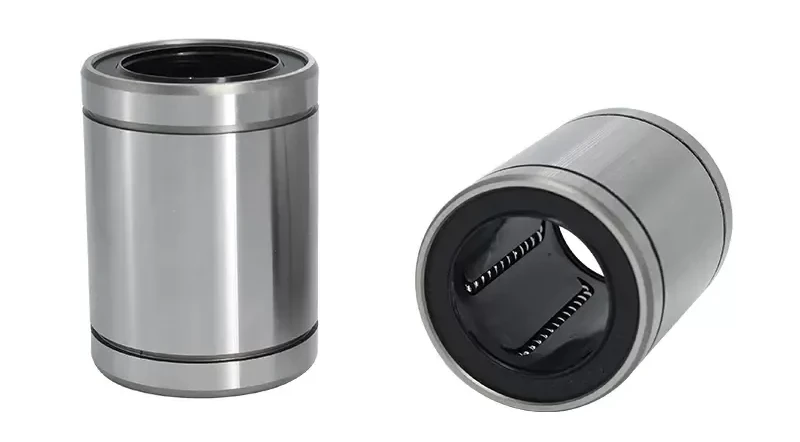

| Type           | Part  | Quantity |
| -------------- | ----- | -------- |
| Linear bearing | LM8UU | 10       |

## Z Axis Couplers


| Type  | Qty | Dia. | Length | Motor Shaft Dia. | Lead Screw Dia. |
| ----- | --- | ---- | ------ | ---------------- | --------------- |
| Rigid | 2   | 20mm | 25mm   | 5mm              | 8mm             |

### Aftermarket Options

[Option 1](https://s.click.aliexpress.com/e/_DFQu2bD)

## Belts

_Coming soon._

### Timing Belt Toothed Pulleys

_Coming soon._

### Timing Belt Smooth Idlers

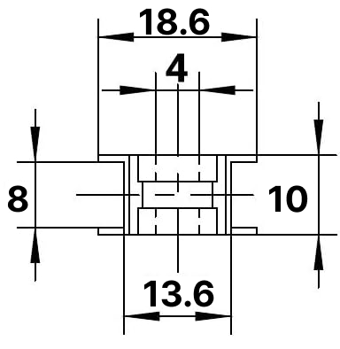

# PSU Related

| Brand       | Model    | Wattage | Voltage |
| ----------- | -------- | ------- | ------- |
| Cheng Liang | P360W24V | 360W    | 24V     |

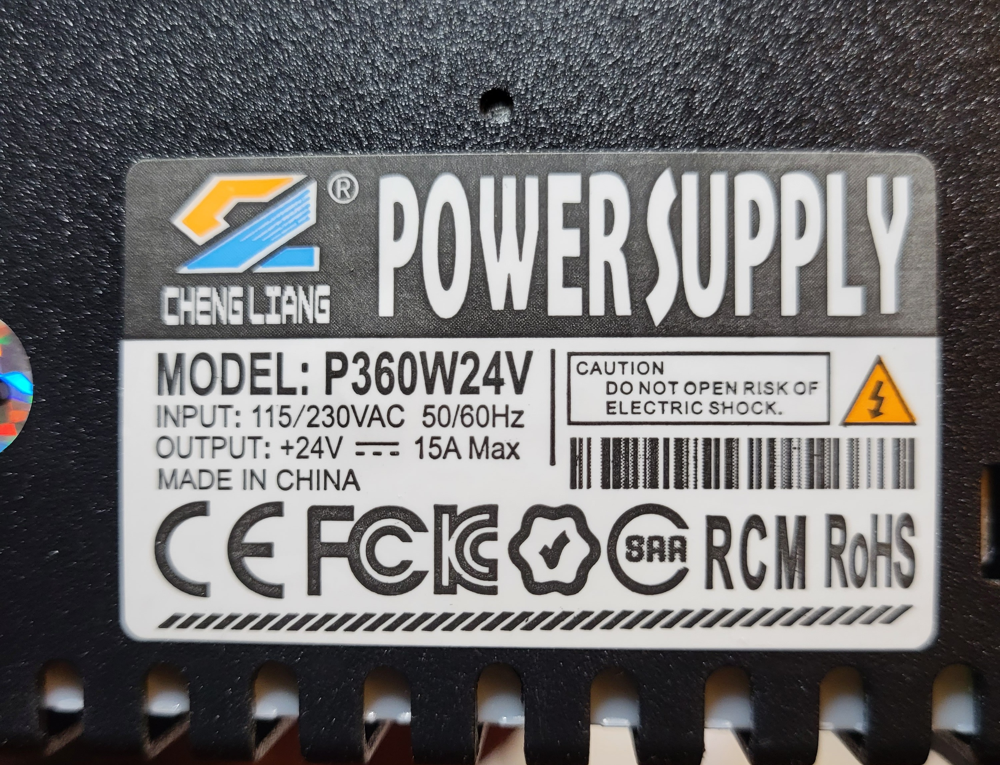

## PSU Connections


## PSU Switch


## Other PSU Cable

| Part      |
| --------- |
| XT60H-M/F |

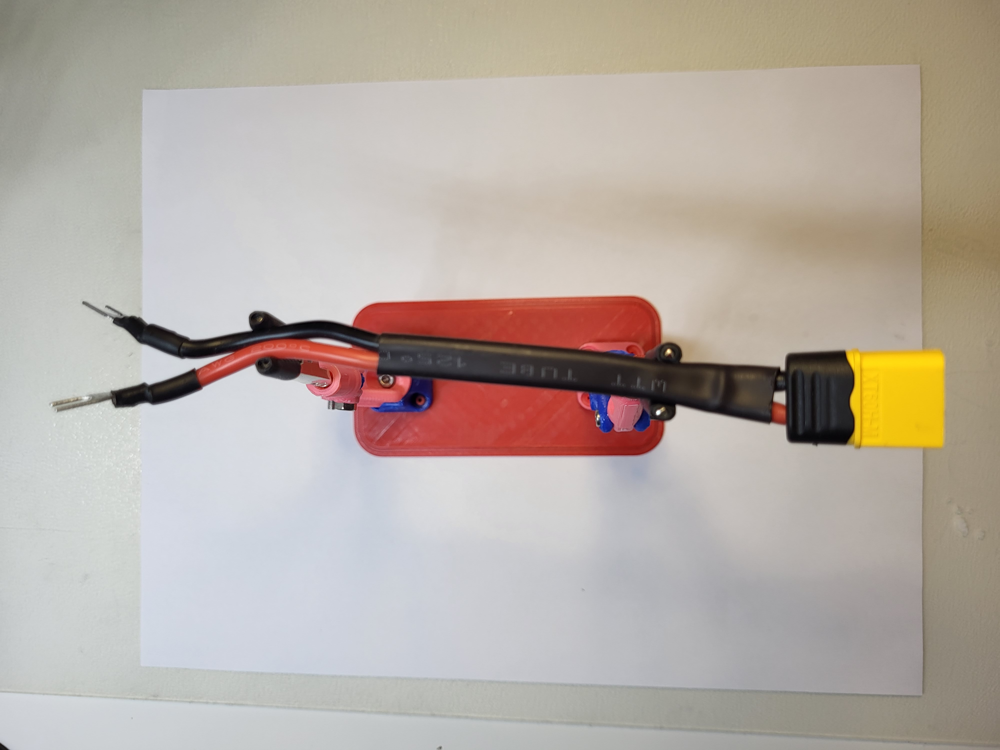
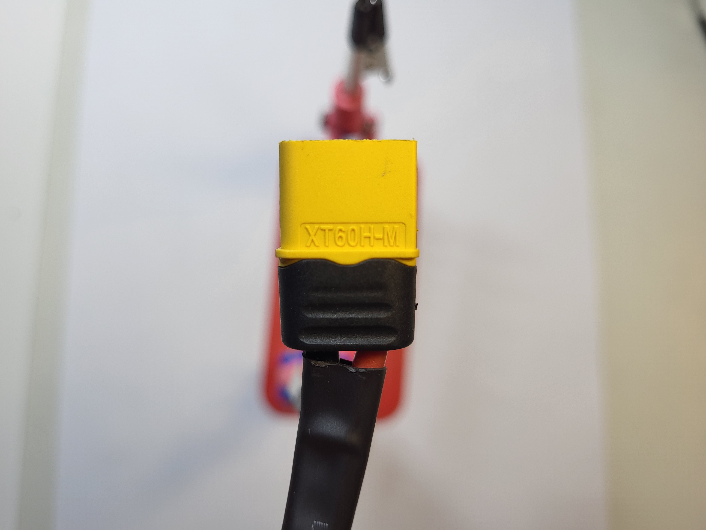
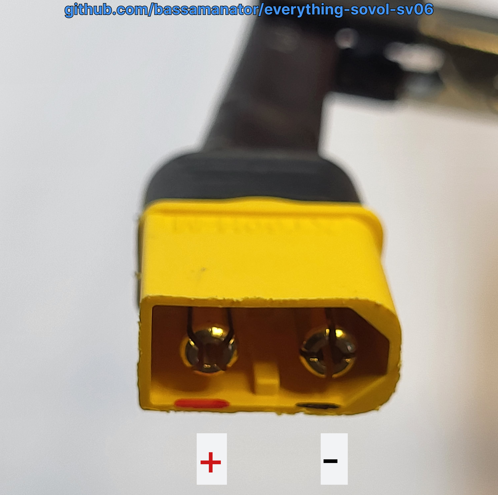

## Internal Fan Cable Connector

| Printer   | Part   | Pitch  |
| --------- | ------ | ------ |
| SV06      | JST-XA | 2.54mm |
| SV06 Plus | JST-XH | 2.54mm |


# Stepper Motors

| Location   | Motor   | Height | Peak current                |
| ---------- | ------- | ------ | --------------------------- |
| Extruder   | Nema 42 | 22     | 0.8A (_needs verification_) |
| X-Gantry   | Nema 42 | 34     | 1.3A                        |
| Bed        | Nema 42 | 34     | 1.3A                        |
| 2 x Z-axis | Nema 42 | 34     | 1.3A                        |

## Y-axis

- In case you need to replace it, you can _probably_ fit a stepper motor with a height of 42mm.
- A stepper motor with a height of 40mm will certainly fit.

# Support Me

Please ⭐ star this repository!

If you found my work useful, consider buying me a [](https://ko-fi.com/bassamanator).

# Stay Up-to-Date

This repository is a work in progress. Watch for updates:


# Useful Links

## Sovol Repositories

- [SV06 Official Marlin Source Code](https://github.com/Sovol3d/Sv06-Source-Code)
- [SV06 Official Models](https://github.com/Sovol3d/SV06-Fully-Open-Source)
- [SV06 Plus Official Marlin Source Code and Models](https://github.com/Sovol3d/SV06-PLUS)

## Resources

- [_OSS_ Sovol SV06 Klipper Configuration](https://github.com/bassamanator/Sovol-SV06-firmware/tree/master)
- [RP2040-Zero ADXL345 Connection Klipper](https://github.com/bassamanator/rp2040-zero-adxl345-klipper)

[](https://ko-fi.com/H2H0HIHTH)
