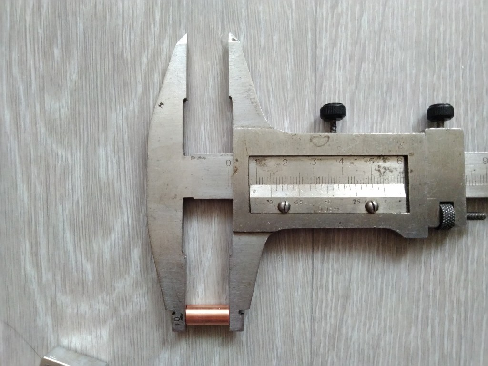
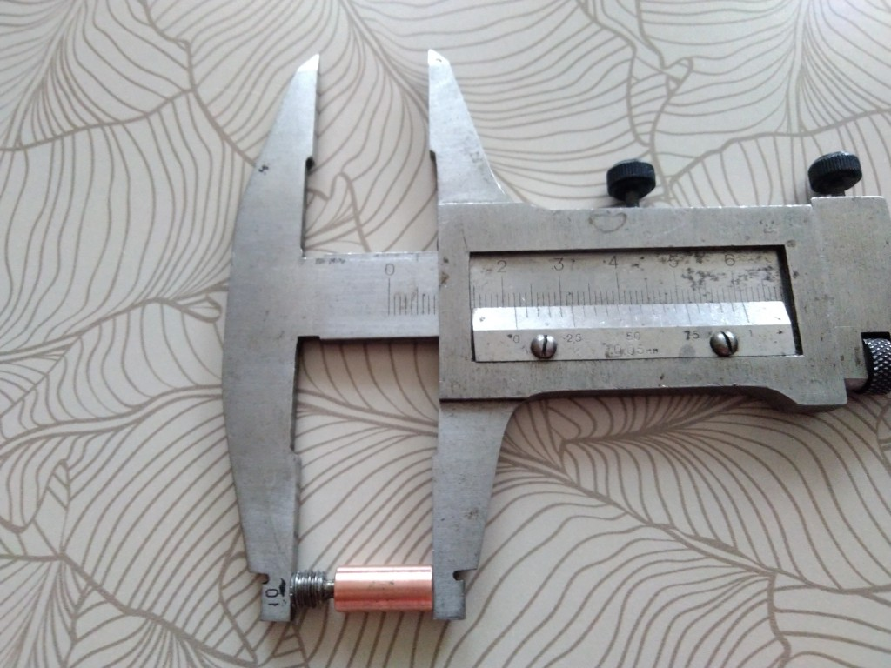
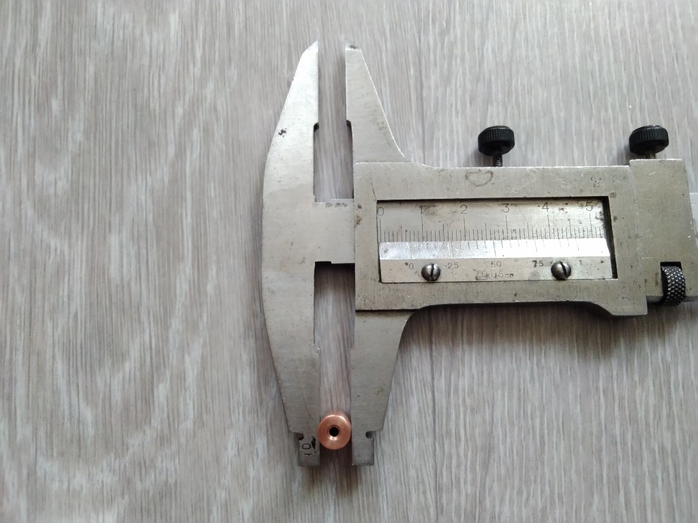

# Everything Sovol SV06

A repository containing specifications of the Sovol SV06 3D printer parts, as well as links to aftermarket replacement parts.

Besides many hours, I have spent roughly ~~CAD$80~~ CAD$85 on unusable parts in order to find aftermarket replacements for the SV06. If you found this work useful, please consider buying me a [](https://ko-fi.com/bassamanator).

You can also contribute by making a [pull-request](https://github.com/bassamanator/everything-sovol-sv06/pulls), creating an [issue](https://github.com/bassamanator/everything-sovol-sv06/issues), or starting a [discussion](https://github.com/bassamanator/everything-sovol-sv06/discussions).

*Some of the links found on this page may be affiliate links.*

## To do:

- [ ] Add stepper motor information.
- [x] Add Z coupler specs.
- [x] Add heatblock specs.
- [ ] Verify heatblock specs.
- [x] Add heatbreak specs.
- [ ] Add heater cartridge specs; no aftermarket source to be found.
- [ ] Add thermistor specs and aftermarket [source](https://s.click.aliexpress.com/e/_DmxAvaV).
- [X] Add PSU related information.

## Stay Up-to-Date

This repository is a work in progress. Watch for updates:


## Hotend

### PCB SV06ZJB_V1.4


| Label | Connection | PCB Connection | Other Connection | Other info |
| - | - | - | - | - |
| P3 | Coldend fan | JST 1.25mm 2-Pin |  |  |
| P2 | Extruder motor | JST 1.25mm 4-Pin | JST PH 2.0 6-Pin (*needs confirmation*) | Cable length 12cm |
| P4 | Heater cartridge | JST PH 2.0 2-Pin |  |  |
| P8 | Thermistor | JST 1.25mm 2-Pin |  |  |
| P6 | Probe  | JST 1.25mm 5-Pin |  |  |
| P5 | Part cooling fan | JST 1.25mm 2-Pin |  |  |
| P7 | Filament sensor | JST 1.25mm 3-Pin |  |  |

### Filament Sensor

I tested two random filament runout sensors that I had on hand. Both work just fine. It seems to me that any sensor with `VCC`, `Ground`, and `Signal` pins should work.

In order to get the filament sensor working, just make sure that the `VCC`, `Ground`, and `Signal` line up with the pins on the hotend PCB, port `P7`.

In order to 'mount' the sensor while it's not in use, simply glue a small magnet onto the sensor. You can then stick the sensor onto the extruder motor. You might also want to tether the sensor to the extruder cable with a piece of string.

Klipper filament configuration section:
```
[filament_switch_sensor filament_sensor]
switch_pin: !PA4 # "Pulled-high"
pause_on_runout: True
insert_gcode:
    M117 Insert Detected
runout_gcode:
    M117 Runout Detected
```

The complete Klipper code to make this work is part of my [OSS Klipper Configuration](https://github.com/bassamanator/Sovol-SV06-firmware).


#### Aftermarket Options

These can be found for very cheap (roughly $1.5) on Aliexpress and quite a bit more on  Amazon (though still very afforable). [This](https://s.click.aliexpress.com/e/_DDLpdBX) is the one I bought. Here's another seemingly [viable option](https://s.click.aliexpress.com/e/_DDPNmDX).

##### How To Cable

You need to make your own cable. I recommend getting these [JST 1.25 cables](https://s.click.aliexpress.com/e/_DDORZ0D), and this [XH2.54 kit](https://s.click.aliexpress.com/e/_DlejPpj). You will also need a crimping tool such as the [Engineer PA-09](https://www.amazon.ca/gp/product/B002AVVO7K/ref=ppx_yo_dt_b_search_asin_title?ie=UTF8&psc=1).
### Heatblock


| Height | Length | Thickness |
| - | - | - |
| 20mm | 20mm| 10mm|

*\*The specs in this picture need confirmation. Coming soon.*


### Heatbreak


| Cooper Portion | Overall Length | Outer Dia. | Inner Dia. |
| - | - | - | - |
| 15mm | 22mm | 7mm| 2mm|





#### Aftermarket Options

I purchased and tested [this heatbreak](https://s.click.aliexpress.com/e/_DmzWJNb). It works as well as the stock piece.

*The part sold in the link could change, so make sure it has the following specs*:


## Motherboard


## Lead Screws and Rods

### Lead Screws

| Axis | Qty | Length | Dia. | Lead | Pitch | Starts | Sovol Part # |
| - | - | - | - | - | - | - | - |
| Z | 2 | 376mm | 8mm | 4mm | 2mm | 2 | JXHSV06-02003-a |

### Linear Motion Guide Rods

| Axis | Qty | Length | Dia. | Sovol Part # |
| - | - | - | - | - |
| X | 2 | 350mm | 8mm | JXHSV06-03001-a |
| Y | 2 | 340mm | 8mm | JXHSV06-01012-a |
| Z | 2 | 400mm | 8mm | JXHSV06-02004-a |

## Z Axis Couplers


| Type | Qty | Dia.| Length | Motor Shaft Dia. | Lead Screw Dia. |
| - | - | - | - | - | - |
| Rigid | 2 | 20mm | 25mm | 5mm | 8mm |

## PSU Related


### PSU Connections


### PSU Switch


## Sovol Repositories

- [Marlin source code](https://github.com/Sovol3d/Sv06-Source-Code)
- [Printer parts STL and STEP files](https://github.com/Sovol3d/SV06-Fully-Open-Source)

## Useful Resources

- [*OSS* Sovol SV06 Klipper Configuration](https://github.com/bassamanator/Sovol-SV06-firmware/tree/master)
- [RP2040-Zero ADXL345 Connection Klipper](https://github.com/bassamanator/rp2040-zero-adxl345-klipper)

[](https://ko-fi.com/H2H0HIHTH)
