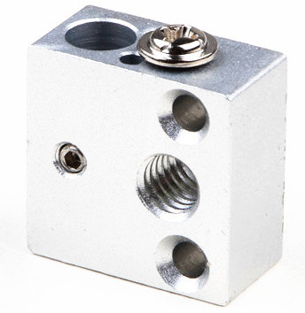
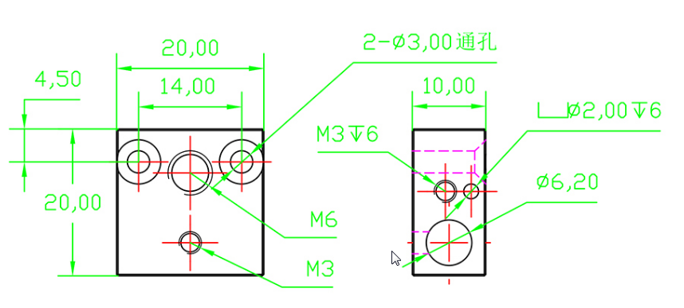
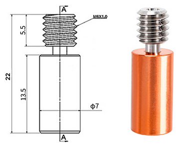
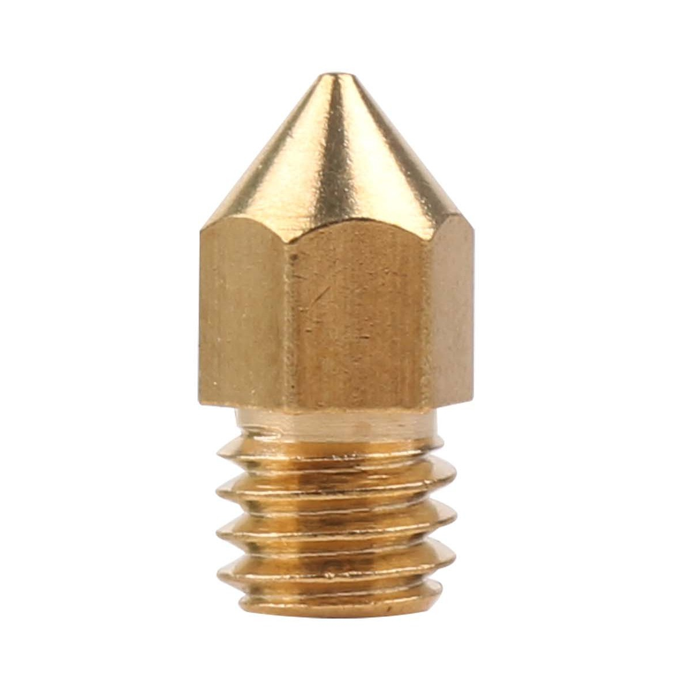
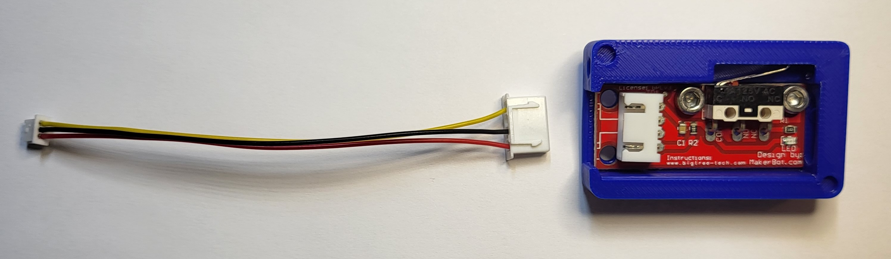
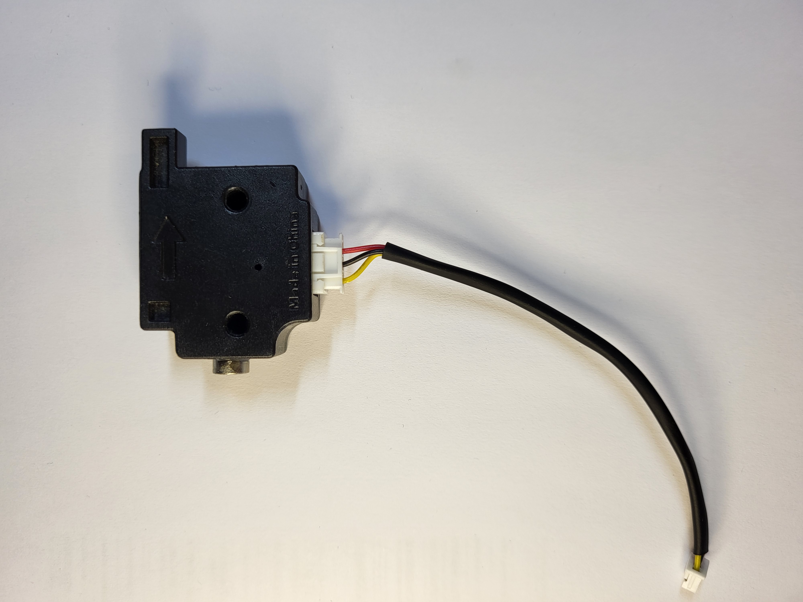
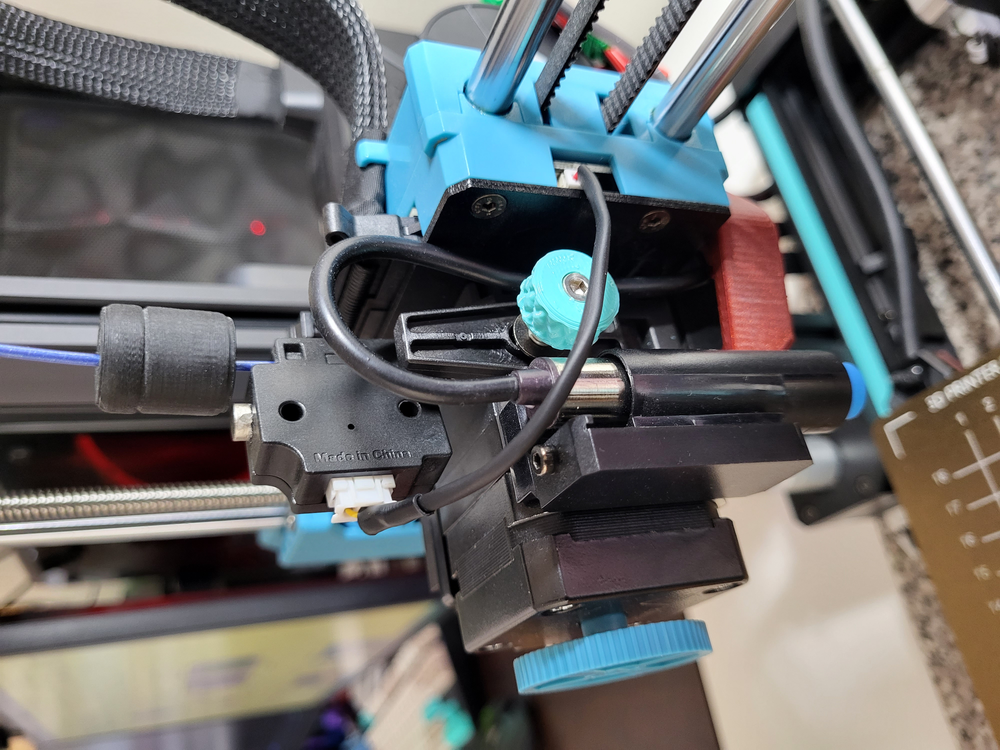
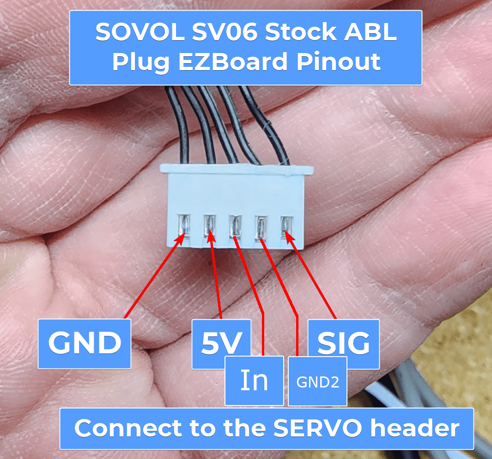

# Print Head

[](https://ko-fi.com/bassamanator)

## PCB

Revision: `SV06ZJB_V1.4`


| Label | Connection       | PCB Connection        | Other Connection | Other info        |
| ----- | ---------------- | --------------------- | ---------------- | ----------------- |
| P3    | Coldend fan      | Molex PicoBlade 2-Pin |                  |                   |
| P2    | Extruder motor   | Molex PicoBlade 4-Pin | JST PH 2.0 6-Pin | Cable length 12cm |
| P4    | Heater cartridge | JST PH 2.0 2-Pin      |                  |                   |
| P8    | Thermistor       | Molex PicoBlade 2-Pin |                  |                   |
| P6    | Probe            | Molex PicoBlade 5-Pin |                  |                   |
| P5    | Part cooling fan | Molex PicoBlade 2-Pin |                  |                   |
| P7    | Filament sensor  | Molex PicoBlade 3-Pin |                  |                   |

\* _Note, Molex PicoBlade are often mischaracterized as JST 1.25mm (the name under which they are usually sold online)._

## Hotend



| Model         | Material |
| ------------- | -------- |
| Creality CR10 | Aluminum |

Notes:

- The heatblock is mounted onto the extruder assembly using `2 x M2.5 x 10mm` [SHCS](./images/shcs.png).
- Newer heatblocks appear to have a 3mm thermistor hole.

<p align="center">

</p>

### Aftermarket Options

Any of [these](https://s.click.aliexpress.com/e/_Dle8W0N) heatblocks will do just fine, however, they _may_ require mounting bolts of different sizes.

- The [Type C](https://s.click.aliexpress.com/e/_DEfTKT1) has 2mm and 3mm thermistor holes.
- I have the `Type C`. The original mounting bolts will not be long enough, you will need [2 x M2.5 x 16mm FHCS](https://s.click.aliexpress.com/e/_DFDH4Hl) ([2 x M2.5 x 18mm FHCS](https://s.click.aliexpress.com/e/_DEbXHQ7) will also work).

### Heater Cartridge

The SV06 uses a ceramic heater cartridge.

| Voltage | Watts | Dimensions | Connection       | Cable Length |
| ------- | ----- | ---------- | ---------------- | ------------ |
| 24V     | 50W   | 6x20mm     | JST PH 2.0 2-Pin | ~40mm        |

The heater cartridge is glued into the heatblock, a heatblock that heats to 300C. Although possible, it is inadvisable, and potentially dangerous to attempt removal.

#### Aftermarket Options

Unfortunately, a direct, non-DIY replacement seems unlikely. It appears that no one sells heater cartridges with JST PH 2.0 2-Pin connectors.

You would have to buy a heater cartridge such as [this](https://s.click.aliexpress.com/e/_DeKbxqv), and crimp the appropriate connector on.

⚠️ This is not an ordinary crimp job. The hotend assembly consumes a lot of power and is dangerously hot. Take every precaution.

### Thermistor

| Material   | Dimensions | Connection            | Cable Length |
| ---------- | ---------- | --------------------- | ------------ |
| Glass-bead | 2mm        | Molex PicoBlade 2-Pin | ~40mm        |

The thermistor is held in place with the help of a screw, and a generous amount of thermal adhesive. With the help of a heat-gun, and with great care, it can be removed.

#### Aftermarket Options

- [3mm Tube Thermistor](https://s.click.aliexpress.com/e/_DnBUliL)
  - Please note that this thermistor will **not** fit in the stock heatblock. You need a heatblock that has a 3mm thermistor hole.
- [3mm Tube Thermistor 4 units](https://s.click.aliexpress.com/e/_Dmwf20F)
  - **Untested** though it looks exactly the same as the option above.
  - Cheaper than then first option.
  - Please note that this thermistor will **not** fit in the stock heatblock. You need a heatblock that has a 3mm thermistor hole.

### Heatbreak

<!--  -->



| Cooper Portion | Overall Length | Outer Dia. | Inner Dia. |
| -------------- | -------------- | ---------- | ---------- |
| 15mm           | 22mm           | 7mm        | 2mm        |

#### Aftermarket Options

I purchased and tested [this heatbreak](https://s.click.aliexpress.com/e/_DmzWJNb).

- It works as well as the stock piece.
- ⚠️ It is 1mm shorter than the stock piece, so you will need a washer or spacer of some kind to 'increase' it's length. If you don't add a spacer, your part cooling duct will be exactly inline with the nozzle tip, meaning that the part cooling duct will drag across every new layer. The spacer must not be more than 7mm in diameter.

_The part sold in the link could change, so make sure it has the following specs_:


### Nozzle



| Type | Thread |
| ---- | ------ |
| MK8  | M6     |

Any MK8 nozzle will do. You can even use a [V6 style nozzle](./images/nozzle/nozzle-comparison.jpg).

#### Aftermarket Options

**Any** MK8 nozzle will be fine. I like [these](https://s.click.aliexpress.com/e/_DCDKb0n) because they're chunky.

##### SV06 Plus

A Creality K1 nozzle seems like a suitable replacement (_needs verification_), however, it is 0.5mm shorter than the stock variant. You have to make use of a washer/spacer to correct for this, see [Heatbreak, Aftermarket](#aftermarket-options-3) section.

## Filament Sensor

I tested two random filament runout sensors that I had on hand. Both work just fine. It seems to me that any sensor with `VCC`, `Ground`, and `Signal` pins should work.

In order to get the filament sensor working, just make sure that the `VCC`, `Ground`, and `Signal` line up with the pins on the hotend PCB, port `P7`.

<details>
<summary>Alternate connection</summary>
You can connect the sensor directly to the motherboard's `Pre-set port`. By default, this port has the `DET` cable connected to it.
</details>

In order to 'mount' the sensor while it's not in use, simply glue a small magnet onto the sensor. You can then stick the sensor onto the extruder motor. You might also want to tether the sensor to the extruder cable with a piece of string.

### Klipper configuration

```
[filament_switch_sensor filament_sensor]
switch_pin: !PA4 # "Pulled-high"
pause_on_runout: True
insert_gcode:
    M117 Insert Detected
runout_gcode:
    M117 Runout Detected
```

The complete Klipper code to make this work is part of my [OSS Klipper Configuration](https://github.com/bassamanator/Sovol-SV06-firmware).





### Aftermarket Options

These can be found for very cheap (roughly $1.5) on Aliexpress and quite a bit more on Amazon (though still very affordable). [This](https://s.click.aliexpress.com/e/_DDLpdBX) is the one I bought. Here's another seemingly [viable option](https://s.click.aliexpress.com/e/_DDPNmDX).

### Cable How-To

You need to make your own cable. I recommend getting these [JST 1.25 cables](https://s.click.aliexpress.com/e/_DDORZ0D), and this [XH2.54 kit](https://s.click.aliexpress.com/e/_DlejPpj). You will also need a crimping tool such as the [Engineer PA-09](https://www.amazon.ca/gp/product/B002AVVO7K/ref=ppx_yo_dt_b_search_asin_title?ie=UTF8&psc=1).

## Probe

<p align="center">
    
</p>
<p align="center">

</p>

| Part          | Voltage | Type                  | Measuring Distance |
| ------------- | ------- | --------------------- | ------------------ |
| LJ12A3-4-Z-AX | ~5V     | NPN (normally closed) | ~4mm               |

### Aftermarket Options

- I bought this probe [LJ12A3-4-Z-AX](https://s.click.aliexpress.com/e/_Dm2TIhh) to keep as a backup. _Completely Untested_.

## Extruder

The parts from a DIY Orbiter V1.5 kit are suitable replacements for this extruder. I'll do a more thorough write-up eventually, but in the meantime, the only parts that differ in the Orbiter are:

- the 3 pronged stem is longer in the Orbiter though that should not be an issue.
- the flanged bearing has a larger OD in the Orbiter.
- I did not compare the filament gears.

After over 600 hours of print time, I saw hardly any wear on the gears in the extruder.

### Aftermarket Options

- [This](https://s.click.aliexpress.com/e/_DE2NRWZ) is the Orbiter kit that I bought and took measurements from, but any other V1.5 kit should do fine.
- [Mellow](https://s.click.aliexpress.com/e/_DdpgYhT) has a great option as well.

[Back](../README.md)
