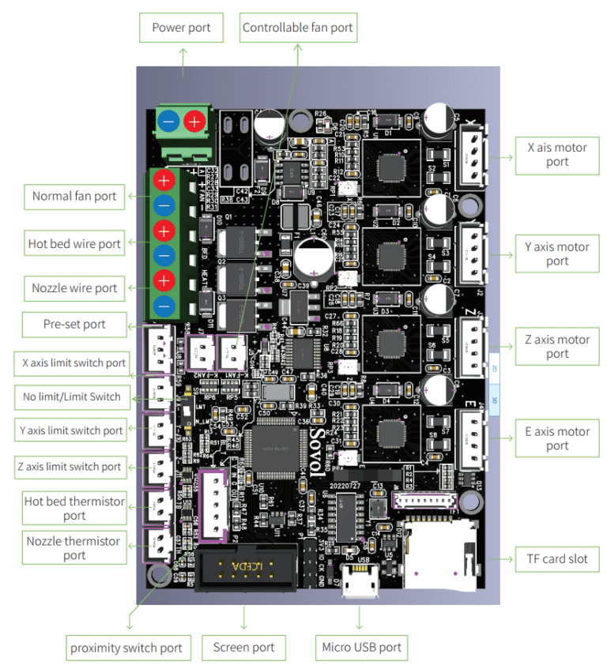

# Motherboard

[⏪ Back](../README.md)

    

### Aftermarket Options

I haven't seen this particular board around, though it should be easy enough to purchase from Sovol3d directly. Having said that, the `SKR-Mini-E3-V2.0/V3.0` are viable replacements that fit perfectly in the stock motherboard enclosure, and likely cheaper than the original board. I would recommend the `V3.0` over the `V2.0 `because I have a hardware guide and a Klipper configuration ready to go on my OSS repository, find link below.

[⏪ Back](../README.md)
