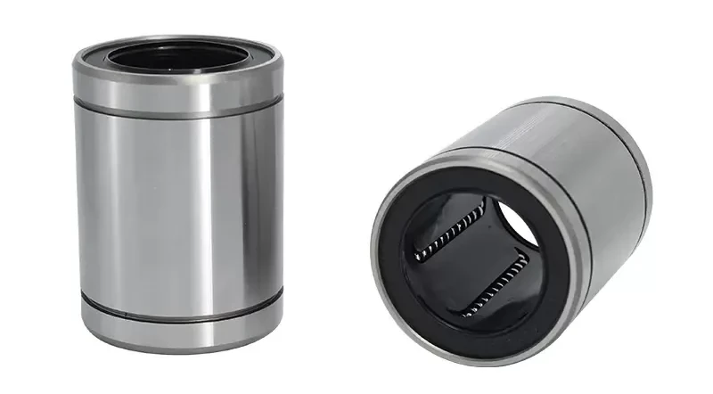
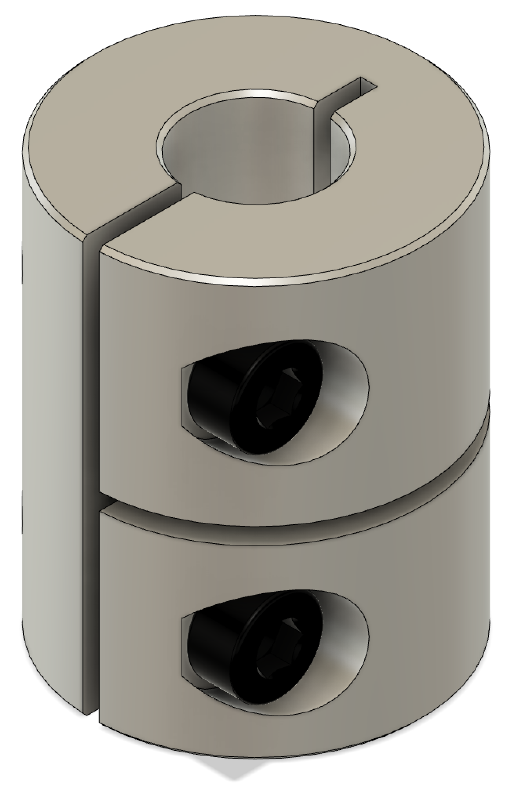
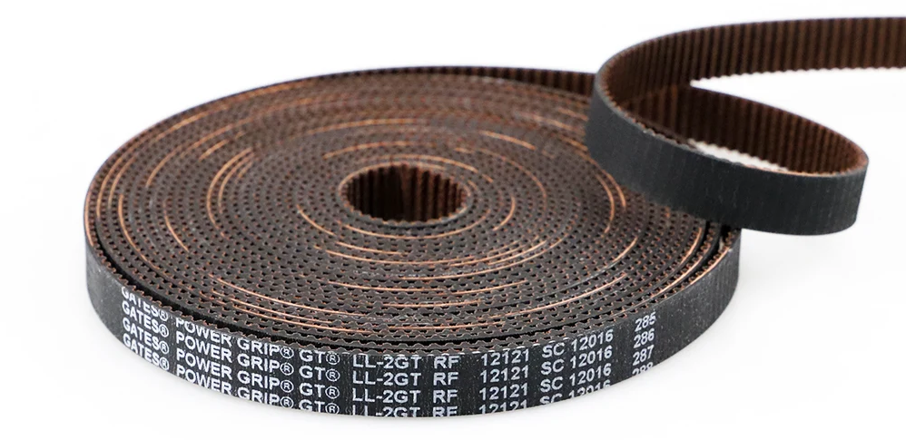
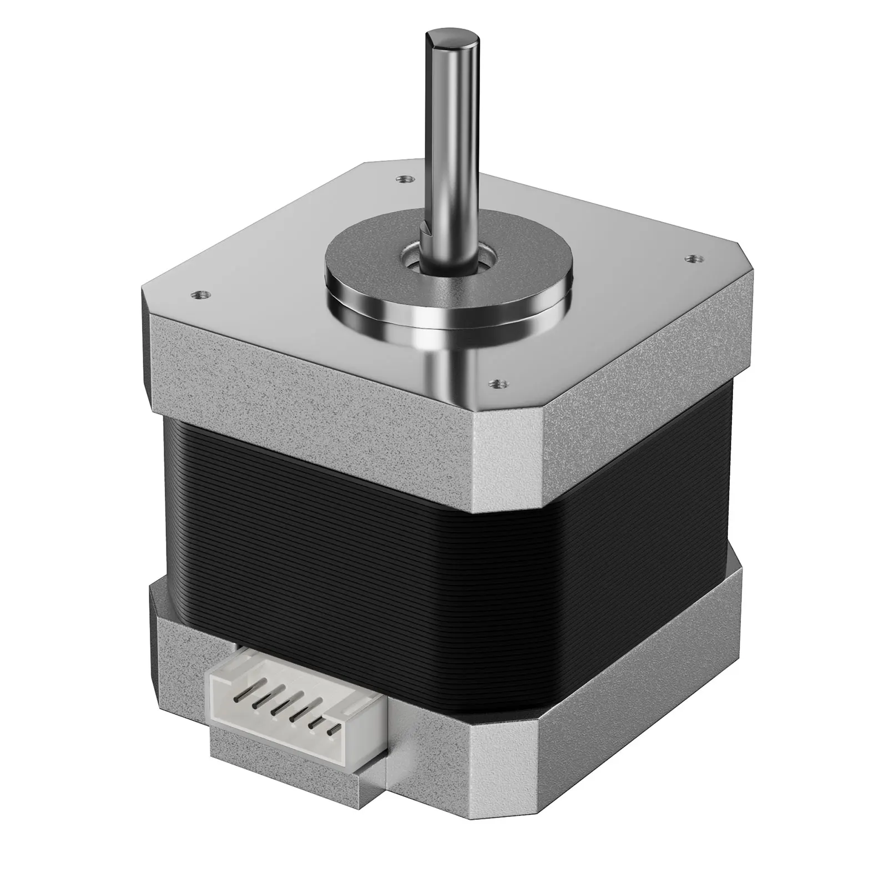

# Motion System

## Lead Screws

| Axis | Qty | Length | Dia. | Lead | Pitch | Starts | Sovol Part #    |
| ---- | --- | ------ | ---- | ---- | ----- | ------ | --------------- |
| Z    | 2   | 376mm  | 8mm  | 4mm  | 2mm   | 2      | JXHSV06-02003-a |

## POM Nuts

| Material                           | Dia. | Lead | Pitch |
| ---------------------------------- | ---- | ---- | ----- |
| Polyoxymethylene (type of plastic) | 8mm  | 4mm  | 2mm   |

### Aftermarket Options

I have been unable to find _direct_ replacements. I am using [these](https://s.click.aliexpress.com/e/_DBMjmq3), however, you will likely have to drill out the attachment holes with a 3mm drill bit (very easy and quick modification). Please note that I'm not using them as anti-backlash nuts, so that portion of these parts will likely go unused.

## Lead Rods

| Axis | Qty | Length | Dia. | Sovol Part #    |
| ---- | --- | ------ | ---- | --------------- |
| X    | 2   | 355mm  | 8mm  | JXHSV06-03001-a |
| Y    | 2   | 340mm  | 8mm  | JXHSV06-01012-a |
| Z    | 2   | 400mm  | 8mm  | JXHSV06-02004-a |

## Linear Bearings

| Type           | Part  | Quantity |
| -------------- | ----- | -------- |
| Linear bearing | LM8UU | 10       |

## Z Axis Couplers

| Type  | Qty | Dia. | Length | Motor Shaft Dia. | Lead Screw Dia. |
| ----- | --- | ---- | ------ | ---------------- | --------------- |
| Rigid | 2   | 20mm | 25mm   | 5mm              | 8mm             |

### Aftermarket Options

[Option 1](https://s.click.aliexpress.com/e/_DFQu2bD)

## Belts

| Brand | Part                 | Length | Width |
| ----- | -------------------- | ------ | ----- |
| GATES | PowerGrip GT2 LL-2GT | ~1.5m  | 6mm   |

### Aftermarket Options

Two meters will handle both the Y and X axis.

- [GATES](https://s.click.aliexpress.com/e/_DCMqSrf)
- [POWGE](https://s.click.aliexpress.com/e/_Dei89Ul)
  - I use these myself, they're top quality.

### Timing Belt Toothed Pulleys

_Coming soon._

### Timing Belt Smooth Idlers

## Stepper Motors

| Location   | Motor   | Height | Peak current                | Step angle |
| ---------- | ------- | ------ | --------------------------- | ---------- |
| Extruder   | Nema 17 | 22     | 0.8A (_needs verification_) | 1.8°       |
| X-Gantry   | Nema 17 | 34     | 1.3A                        | 1.8°       |
| Y-Axis     | Nema 17 | 34     | 1.3A                        | 1.8°       |
| 2 x Z-Axis | Nema 17 | 34     | 1.3A                        | 1.8°       |

### Y-Axis

- In case you need to replace it, you can _probably_ fit a stepper motor with a height of 42mm.
- A stepper motor with a height of 40mm will certainly fit.

[⏪ Back](../README.md)
