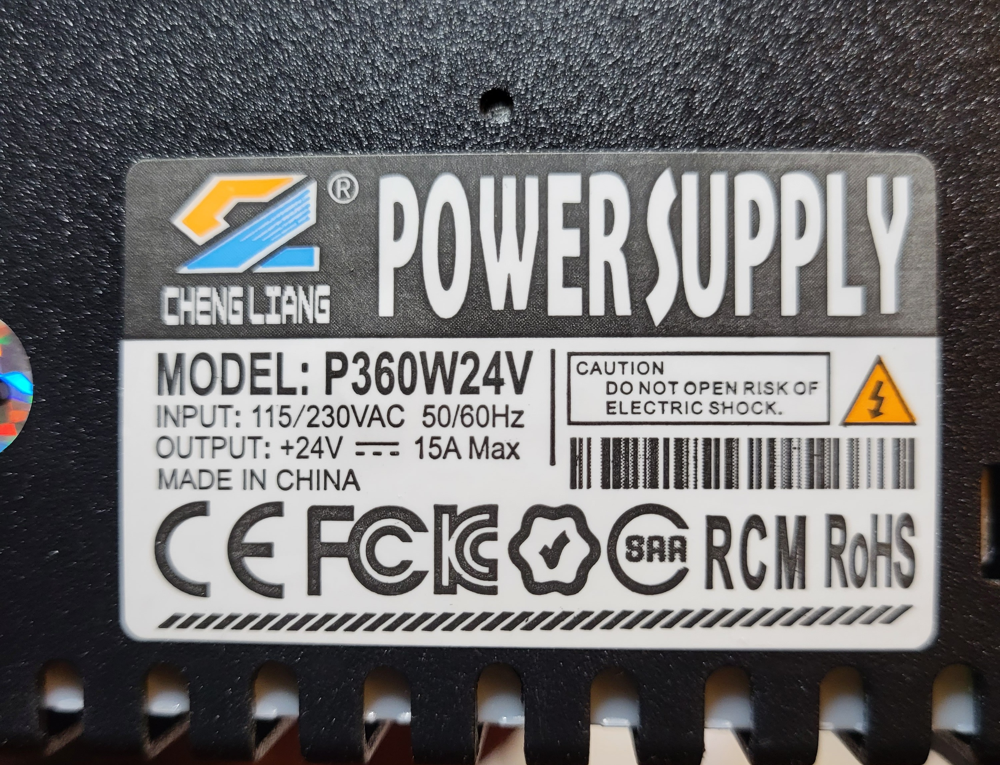

# PSU Related

| Brand       | Model    | Wattage | Voltage |
| ----------- | -------- | ------- | ------- |
| Cheng Liang | P360W24V | 360W    | 24V     |

## PSU Connections

## PSU Switch

## Other PSU Cable

| Part      |
| --------- |
| XT60H-M/F |

## Internal Fan Cable Connector

| Printer   | Part   | Pitch  |
| --------- | ------ | ------ |
| SV06      | JST-XA | 2.54mm |
| SV06 Plus | JST-XH | 2.54mm |

[Back](../README.md)