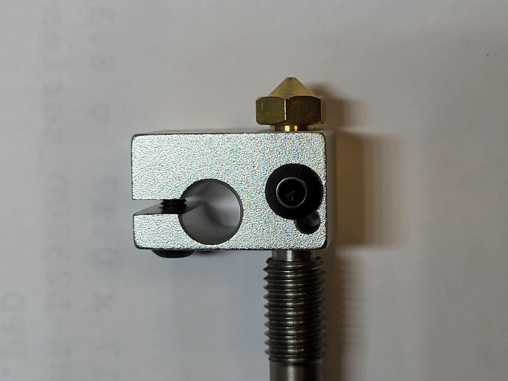
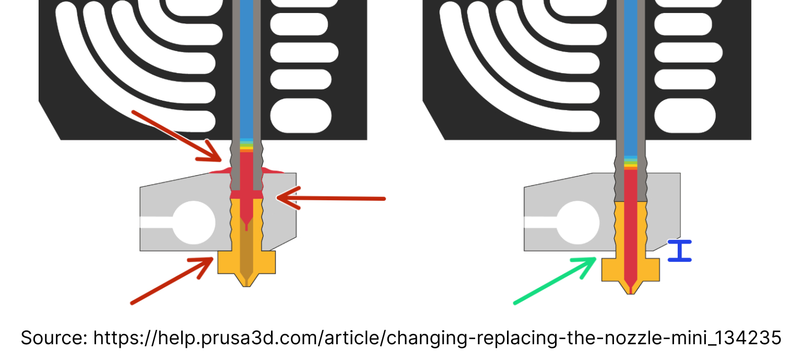

## Changing Nozzles

You can follow the instructions on [this page](https://help.prusa3d.com/article/changing-replacing-the-nozzle-mini_134235). Take extreme caution. Personally, I keep the hotend hot throughout the whole process.

Here is the crucial points:

1. Heat the heatblock _above_ your normal printing temperature. Example, if the hottest material you print is PETG, printed at 245C, heat the heatblock to 265C at the very least.
2. You tighten the ${\normalsize{\textcolor{green}{\texttt{nozzle}}}}$ against the ${\normalsize{\textcolor{green}{\texttt{heatbreak}}}}$, _not_ the ${\normalsize{\textcolor{red}{\texttt{heatblock}}}}$. You can make this happen by controlling how much you thread the heatbreak into the heatblock. If you've done things correctly, at the end, when everything has been tightened, there will be a gap between the nozzle and the heatblock. Aim for about 0.5mm, but the exact length of the gap is not important.
3. Do not overtighten because you will stripe threads or break the nozzle. A [torque wrench](https://www.thingiverse.com/thing:4738816) is highly recommended; you want roughly 1-1.5N\*m of torque.

<div align='center'>
    
    
</div>

## Calibrate Esteps

Follow the instructions [here](https://www.klipper3d.org/Rotation_Distance.html#calibrating-rotation_distance-on-extruders). Below you will find the accompanying commands. To get an idea of what this process entails, you can search for `calibrate esteps` on Youtube and watch the video of your choosing.

[This](https://thangs.com/designer/MihaiDesigns/3d-model/Extruder%20E-steps%20calibration%20tool-47802) free part is useful in this process, though not necessary. A ruler or caliper will do just fine.

1. Prepare extruder

```
M109 S225 ; set & wait for hotend temp 225C
M83 ; Set E to Relative Positioning
```

2. Extrude 50mm at 1mm/second

```
G1 E50 F60
```

3. Measure actual extruded amount. This can be greater than or less than 50mm.

4. Formula

```
New Rotation Distance = Previous Rotation Distance * (Actual Extruded Amount/Requested Extrusion Amount)
```

5. Repeat this process until Actual Extruded Amount = Requested Extrusion Amount. A variance of 1mm is acceptable, though the more accurate the better.

[Back](./README.md#outline)
