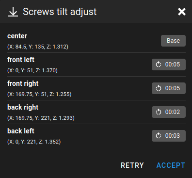

# How To...

## Install Klipper

Please find detailed instructions on the [One-Stop-Shop Klipper Configuration](https://github.com/bassamanator/Sovol-SV06-firmware) repository.

## Change Nozzles

You can follow the instructions on [this page](https://help.prusa3d.com/article/changing-replacing-the-nozzle-mini_134235). Take extreme caution. Personally, I keep the hotend hot throughout the whole process.

Here is the crucial points:

1. Heat the heatblock _above_ your normal printing temperature. Example, if the hottest material you print is PETG, printed at 245C, heat the heatblock to 265C at the very least.
2. You tighten the ${\normalsize{\textcolor{green}{\texttt{nozzle}}}}$ against the ${\normalsize{\textcolor{green}{\texttt{heatbreak}}}}$, _not_ the ${\normalsize{\textcolor{red}{\texttt{heatblock}}}}$. You can make this happen by controlling how much you thread the heatbreak into the heatblock. If you've done things correctly, at the end, when everything has been tightened, there will be a gap between the nozzle and the heatblock. Aim for about 0.5mm, but the exact length of the gap is not important.
3. Do not overtighten because you will stripe threads or break the nozzle. A [torque wrench](https://www.thingiverse.com/thing:4738816) is highly recommended; you want roughly 1-1.5N\*m of torque.

<div align='center'>
    
    
</div>

[Back](./README.md#outline)

## Calibrate Esteps

Follow the instructions [here](https://www.klipper3d.org/Rotation_Distance.html#calibrating-rotation_distance-on-extruders). Below you will find the accompanying commands. To get an idea of what this process entails, you can search for `calibrate esteps` on Youtube and watch the video of your choosing.

[This](https://thangs.com/designer/MihaiDesigns/3d-model/Extruder%20E-steps%20calibration%20tool-47802) free part is useful in this process, though not necessary. A ruler or caliper will do just fine.

1. Prepare extruder

```
M109 S225 ; set & wait for hotend temp 225C
M83 ; Set E to Relative Positioning
```

2. Extrude 50mm at 1mm/second

```
G1 E50 F60
```

3. Measure actual extruded amount. This can be greater than or less than 50mm.

4. Formula

```
New Rotation Distance = Previous Rotation Distance * (Actual Extruded Amount/Requested Extrusion Amount)
```

5. Repeat this process until Actual Extruded Amount = Requested Extrusion Amount. A variance of 1mm is acceptable, though the more accurate the better.

[Back](./README.md#outline)

## Disable USB cable 5V pin

If you are going to connect the printer to any kind of computer (PC, laptop, Raspberry Pi, etc.), you would be wise to use a USB cable that has the 5V pin 'disabled'. Read all about it [here](https://community.octoprint.org/t/put-tape-on-the-5v-pin-why-and-how/13574). I find that [thermal tape](https://s.click.aliexpress.com/e/_DEqaSAr) is easier to install than electrical tape. When everything is taped up correctly, the LCD screen will not light up when a powered off printer is connected to a computer.

## Colour change in PrusaSlicer

See [this video](https://youtu.be/MjOsKk7nB4s).

## Cold-pull

See [this video](https://youtu.be/hBkTeXxcFi8).

## Check and calibrate stepper motor steps

See [this video](https://youtu.be/ZfqeTzc3NpM).

[Back](./README.md#outline)

## Silicon Mod

_These are general, unordered notes on how to do this on the SV06_

Find out what this is about [here](https://www.schweinert.com/silicone-bed-level-mod-prusa-mk3/) and [here](https://github.com/bbbenji/PMSBLM#cons). TLDR you will be replacing 4 of the 5 Aluminum bed spacers with pieces of silicon.

- If you're the kind of user that trusts the `mechanical gantry calibration`/`G34` macro, as I do, then I recommend making sure that this calibration is done before starting. If not, then ignore this step.
- This [printed part](https://www.printables.com/model/43629-prusa-mini-silicone-bed-leveling-mod-bed-tightenin) is essential, but technically not required.
- Your spacers should be about 12mm in length. This [cutting jig](./parts/jig-hose-cutter-D10mm-L14mm.3mf) might be useful.
- Use high temperature silicon (200C). ID: 4mm. OD: 10mm. _Others specifications will also work._
- Keep **center** spacer as is, meaning, keep it metal, not silicon.
- Replace corner spacers with silicon, 4 pieces.
- Tighten the bed into place so that the gap between the bed and carriage is roughly uniform. _Don't stress about this too much, it's just a starting point._
- Run `SCREWS_TILT_CALCULATE` in your dashboard (Klipper). I have no idea what the equivalent is for Marlin, but the links above might help.
- ⚠️ The first time you run `SCREWS_TILT_CALCULATE`, be ready to do an **EMERGENCY STOP** in your dashboard in case there is a collision.
- I recommend getting things pretty level **cold**, then finalize with the bed **hot**.
- The prompt will tell you how much to rotate and the direction of rotation. I recommend you take a snapshot and just hit accept, because you will need to move your printhead out of the way to do the adjustments.

  

- Repeat the process until your satisfied. I'm fine with a deviation of 5 minutes.

## Do Other Stuff

You might find what you're looking for in the Sovol official tech support Youtube [playlist](https://youtube.com/playlist?list=PLR9JZRQ01t7lgsgEfBYiTzZKhnPCwkUZ6&si=Uo920LnMR7Sp3NTe).

## Quieten My Printer

Are you sure your printer is loud? Here's a loud printer for [reference](https://youtu.be/sKfnZUF6sCs?si=elc64Y2rLS-43OFA).

## Improve Bed Adhesion

Contrary to popular belief, you should not be cleaning your build plate after each print. My build plate is washed every 6 weeks or so, if not less often. I use hair spray or glue stick from the dollar store. Take note of the hard core 3d printers like MirageC, Vez3D, etc., their build plates are usually covered in goop, **because it helps with bed adhesion!**

### Here's what you do:

1. Wash your PEI sheet with soap and water.
2. Dry with lint free cloth.
3. Wipe clean with rubbing alcohol.
4. Let air dry for a bit, or use a hair dryer.
5. Apply hair spray that you bought at the dollar store.
   - Apply 5 or 6 even coats in one go.
   - Do not lead the hair spray liquid accumulate in one area (usually it accumulates around the edges of the plate). You want the build area to be as flat as possible.
   - Once somewhat dry, apply another 5 or 6 coats.

You can follow the same process with glue stick, just keep in mind it's harder to get things even.

# Random Questions

## What is input shaping?

I've found this to be the best visual explanation of input shaping:
<a href="https://youtu.be/5fOhi-LL9dU?si=elFdOF6QNNVSGHhy" target="_blank">

</a>
