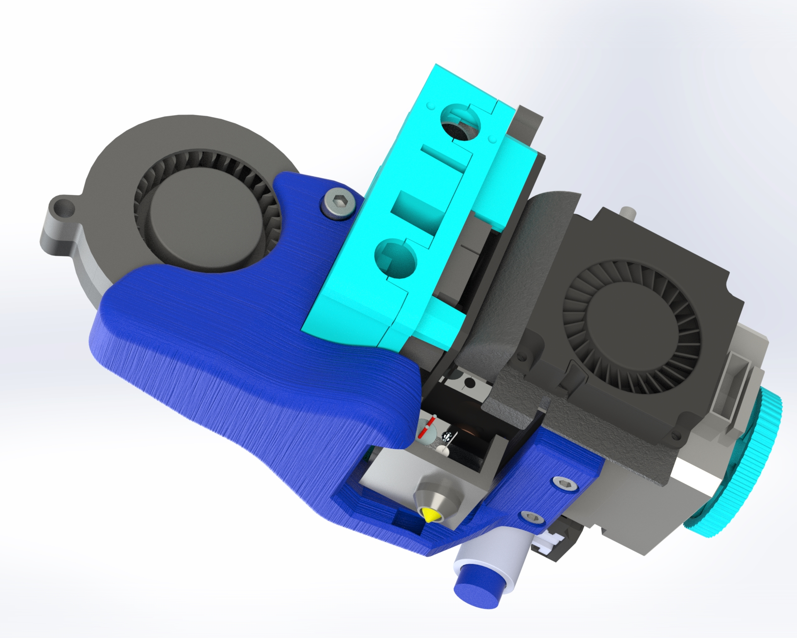
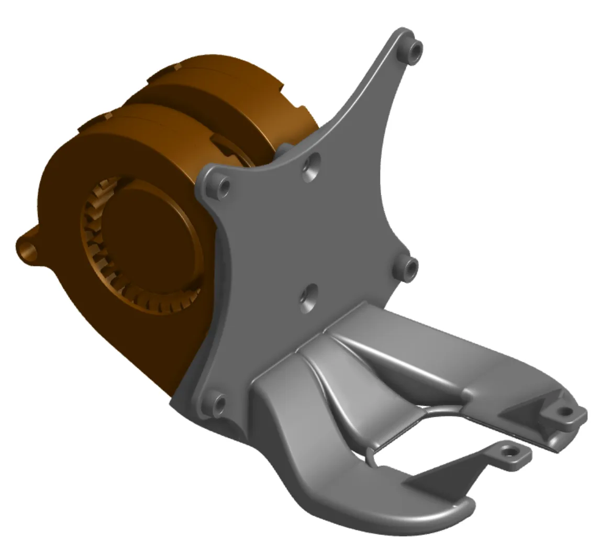
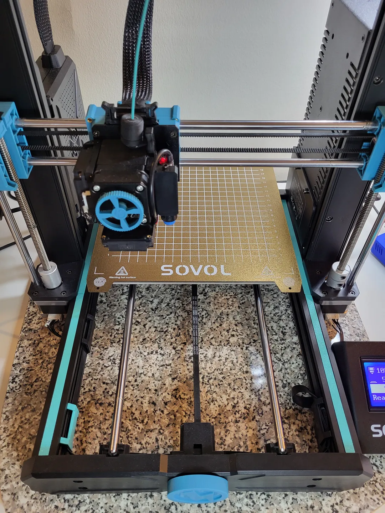

# Printed Upgrades

Please use common sense regarding material choice. If you're printing something that is touching the heated bed or near the hotend, use `PETG`/`ABS`/`other high temperature filament`.

## Essential

### Bed Cable Strain Relief at the Motherboard Enclosure

I no longer recommend a part for this, as I did previously. I think it actually strains the cable which eventually leads to damaged wires, as I experienced.

### Bed Cable Strain Relief at the Bed

- Designer: [@braga3dprint](https://www.printables.com/@braga3dprint)
- Printer: SV06
- [Source](https://www.printables.com/model/452682-sovol-sv06-strain-relief)
- [Download](https://www.printables.com/model/452682-sovol-sv06-strain-relief/files)
- I prefer the flat version as it perfectly supports the cable and doesn't interfere with my part cooling duct.
- After you get the part in place, make sure your bed can move freely without the bed cable snagging at the printer base extrusions.

## Useful

### Frame Mounting Solution

- Designer: [@bassamanator](https://www.printables.com/@bassamanator)
- Printer: SV06 / Plus
- Download from [here](https://www.printables.com/model/431736-sovol-sv06plus-frame-mounting-solution-2040-extrus).

### Part Cooling Fan Duct

- Designer: [taeky](https://cults3d.com/en/users/taeky/3d-models)
- Printer: SV06 (taeky has a Plus version as well).
- **This is a paid model**.
- There is a V2 of this model as well, but the performance according to the designer is the same. I prefer this version because it holds the duct more securely to the extruder assembly.
- [Sovol SV06 fan duct 5015 - CFD optimized](https://cults3d.com/:1021376)

- Designer: [Leander Perez Blanco](https://www.printables.com/@LeanderPerezB_802715)
- Printer: SV06.
- I have not tested this duct yet, but it is CFD optimized as well.
- There is a 1 fan version as well.
- [The Amonite - Sovol SV06 Fan Duct Dual 5015 Blower Fan V4 ](https://www.printables.com/model/543502-the-amonite-sovol-sv06-fan-duct-dual-5015-blower-f)

### Extrusion Seals

- Designer: [@bassamanator](https://www.printables.com/@bassamanator)
- Printer: SV06 / Plus
- Download from [here](https://www.printables.com/model/385359-sovol-sv06plus-extrusion-seal).
